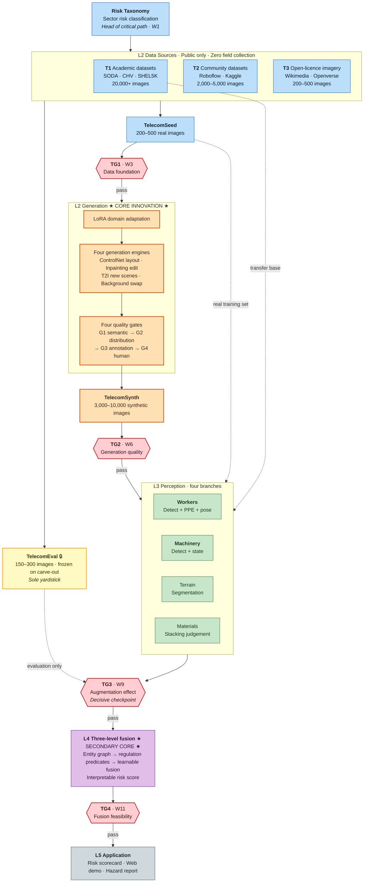
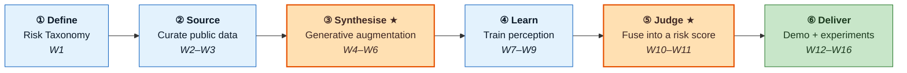
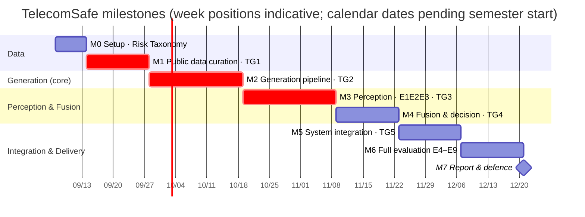

# TelecomSafe — Technological Roadmap

> Document version: **v2.1 (simplified + walkthrough)** ｜ Generated: 2026-08-19 ｜ Revised: 2026-08-25
> Chinese counterpart: [05-技术路线图-CN.md](05-技术路线图-CN.md)
> Roles: [06 Teamwork Allocation](06-Teamwork-Allocation-EN.md) ｜ Detailed schedule: [01 Technical Plan & Milestones](01-Technical-Plan-and-Milestones-EN.md)

**This document governs technology choices and fallbacks; `01` governs the schedule.** Use them together.

---

## One-Page Summary

| | |
|---|---|
| **Innovation bets** | L2 generative augmentation (core) + L4 information fusion (secondary) |
| **Kept conservative** | L3 perception and L5 system layers use mature solutions only — no technical adventures |
| **Three must-pass gates** | TG1 data foundation (W3) → TG2 generation quality (W6) → TG3 augmentation effectiveness (W9) |
| **Critical path** | Risk Taxonomy → public data curation → LoRA → generation engines → **experiment E3** |
| **Largest risks** | ① only 200–500 real telecom images ② negative transfer from synthetic data ③ four-dimension scope too large |
| **Safest bet** | The inpainting route: inherited annotation + minimal domain gap; it does not fail under any circumstances |

---

## 1. Master Technical Flow



**How to read it**

- 🟠 **Orange is where the innovation lives**: the L2 generation layer, and the only part that must be built from scratch
- 🟡 **Yellow TelecomEval has exactly one outgoing edge**: evaluation only, never flowing back into training or generation. Every experimental conclusion depends on this
- 🔴 **Red diamonds are decision gates**: failing one triggers a downgrade path (§4) rather than forcing ahead
- Dashed edges are **auxiliary data flows**; solid edges are the **main chain**

---

## 2. Step-by-Step Walkthrough and Overview

### 2.1 The Whole Flow in One Line

A question that comes up often: **is the main line of this project "collect data → generate more data → train → build a front end"?**

Broadly yes, but **one step is missing in the middle, and both ends need correcting**. The full line has six steps:



**Against the common understanding**:

| Common understanding | Actual flow | The difference |
|---|---|---|
| Collect data | ① Define criteria → ② **Curate** public data | "What counts as a risk" must be defined first; and there is **no field collection** — data is screened from public sources |
| Generate more data | ③ Generative augmentation | ✅ Matches; this is the project's first core innovation |
| Train | ④ Train perception models | ✅ Matches |
| — | ⑤ **Fuse into a risk score** | ⚠️ **This step is missing**, and it is the second core innovation |
| Build a front end | ⑥ Demo **+ experimental validation** | The demo is for the defence; **the E1–E9 experiments are the real academic deliverable** |

> 💡 **The two corrections that matter most**
> 1. **⑤ must sit between ④ and ⑥.** Perception models output "there is a person without a helmet here" and "there is an excavator there" — a pile of **isolated detection boxes**. What the project brief asks for is to `accurately appraise the potential risks`, i.e. to answer "how dangerous is this work face overall". Turning the former into the latter is exactly what step ⑤ does.
> 2. **⑥ is not primarily about the front end.** The web demo carries little weight; the real deliverable is the E1–E9 experiments (above all E3, which proves the generated data actually improved performance). Without experimental data, the project is "we built some software", not research.

---

### 2.2 The Six Steps in Detail

#### ① Define · Risk Taxonomy

> **In**: the four risk dimensions from the project brief ｜ **Out**: a decidable risk taxonomy (4 categories × 20–30 sub-classes)
> **When**: W1 ｜ **Owner**: Member A ｜ **Gate**: TG1

Translate vague phrases such as "uneven terrain" and "poorly stored materials" into criteria **a machine and a person can apply consistently**. "Poorly stored", for instance, becomes "stack height / base width > 1.5, or encroaching beyond the demarcated zone, or obstructing a passageway".

**Why it cannot be skipped**: the people annotating, the people writing generation prompts and the people running the evaluation must all read the same word the same way. Vague definitions do not merely slow annotation down — **all three groups drift apart, the data stops lining up, and the experimental conclusions become invalid**. That is why this sits first and heads the critical path.

#### ② Source · Curate Public Data

> **In**: public online data sources ｜ **Out**: TelecomSeed (200–500 images) + 🔒 TelecomEval (150–300, frozen)
> **When**: W2–W3 ｜ **Owner**: Member A (everyone assists with searching) ｜ **Gate**: TG1

**Not photography on site**, but screening and curation across three public tiers:

- **T1 academic datasets** (SODA / CHV / SHEL5K, 20,000+ images) — generic construction, used as the transfer base
- **T2 community datasets** (Roboflow Universe telecom tower and safety harness sets, Kaggle construction safety set) — dedicated telecom-tower and harness data, and NO-Hardhat negatives already labelled
- **T3 openly licensed imagery** (Wikimedia Commons / Openverse) — manually searched and screened; **the only source of sector specificity**

**Why it cannot be skipped**: the generative model needs real seed images for fine-tuning (otherwise it cannot render telecommunication scenes), and the experiments need real images as the measuring stick. ⚠️ Source and licence attribution **must be recorded per image while searching** — a hard requirement of CC BY / CC BY-SA that is close to impossible to reconstruct afterwards.

#### ③ Synthesise · Generative Augmentation ★ First core innovation ★

> **In**: TelecomSeed + risk scenario specification library ｜ **Out**: TelecomSynth (3,000–10,000 annotated synthetic images)
> **When**: W4–W6 ｜ **Owner**: Member B (lead) + Member A (deputy) ｜ **Gate**: TG2

SDXL plus LoRA learns what telecommunication construction looks like, then four routes produce data at scale:

| Route | How | Where the annotation comes from |
|---|---|---|
| **Inpainting edit** | Erase the helmet from a real image | The person box is inherited unchanged; only the label flips |
| **ControlNet layout** | Draw a semantic layout map, then generate the image | The layout map *is* the segmentation annotation |
| **T2I new scenes** | Text-describe a rare hazardous scene | Needs Grounding DINO auto-labelling plus a consistency check |
| **Background swap** | Convert to rain, night or fog | Annotation is entirely unchanged |

Everything generated then passes **four quality gates** (semantic consistency / distributional consistency / annotation reliability / human spot-check); expect only 50–65% to survive.

**Why it cannot be skipped**: this is the reason the project exists. Two or three hundred real images cannot train a usable model, and the most dangerous scenes (leaning out from a tower without a harness) simply cannot be photographed in reality, nor should anyone try. **⚠️ The key property is "generation is annotation"** — if synthetic images still need manual labelling, nothing has been solved. Three of the four routes above yield their annotations for free.

#### ④ Learn · Train Perception Models

> **In**: TelecomSeed + TelecomSynth mixed ｜ **Out**: four-branch perception models + E1/E2/E3 results
> **When**: W7–W9 ｜ **Owner**: Member C (workers) + Member D (scene) ｜ **Gate**: TG3 ← **the decisive checkpoint**

Four parallel branches, one per dimension: Workers (people + PPE + pose), Machinery (machines + state), Terrain (ground segmentation), Materials (stacking judgement).

Three comparison experiments run alongside — **the most important numbers in the whole project**:

| Experiment | Training data | Purpose |
|---|---|---|
| E1 | Real data only | Baseline |
| E2 | + conventional augmentation (flip / crop) | Rules out "any extra data helps" |
| **E3** | **+ generative augmentation** | **Proves this project's method works** |

**Why it cannot be skipped**: E3 minus E2 *is* the project's proof of value. If the gain falls short of 2 mAP, take downgrade path D3 (narrow the claim to long-tail rare classes) rather than forcing ahead.

#### ⑤ Judge · Information Fusion ★ Second core innovation, and the step most often missed ★

> **In**: detection / segmentation / attribute output from the four branches ｜ **Out**: site-level risk score + interpretable trigger reasons
> **When**: W10–W11 ｜ **Owner**: Member E ｜ **Gate**: TG4

Turn a pile of isolated boxes into an interpretable risk judgement, in three levels:

```
Level 1  Entity graph   Relate people, machines, materials and terrain
                        e.g. worker_1 --[1.2 m away]--> excavator_1
                             worker_2 --[standing on]--> uneven_ground_3

Level 2  Rule layer     Encode safety regulations as decidable conditions
                        work at height AND no harness       -> critical violation
                        person-machine distance < safe radius -> high risk
                        person within 1 m of trench AND no rail -> high risk

Level 3  Learnable      A GNN learns weights and interactions among rules
         fusion         Outputs a 0-1 risk score + per-source contribution
```

**Why it cannot be skipped**: this is the dividing line between "detection" and "risk assessment". Stop at ④ and you deliver a detector; reach ⑤ and you deliver the **risk appraisal framework** the brief asks for. The rule layer also aligns directly with real regulations (OSHA, GB 26859), making every score **traceable to a specific clause** — safety decisions must be explainable, the industry will not accept a black box, and this is what persuades reviewers.

#### ⑥ Deliver · System Demo + Experimental Validation

> **In**: all models and experimental results ｜ **Out**: web demo + full E1–E9 + the EE6008 report
> **When**: W12–W16 ｜ **Owner**: Member E (system) + everyone (experiments and report) ｜ **Gate**: TG5

Two parts, carrying **very different weight**:

| | Content | Weight |
|---|---|---|
| **System demo** | Upload image → four-dimension overlay → risk scorecard → triggered rules | For the defence; visually important, academically light |
| **Experimental validation** | The full E1–E9: augmentation effectiveness, domain gap, ratio curve, long-tail classes, **robustness**, fusion ablation, cross-site generalisation | ⭐ **The real academic deliverable** |

**Why experiments outweigh the demo**: the brief asks to `develop and evaluate` and states `high effectiveness and robustness` explicitly. Effectiveness is proven by E3; robustness by E7 (how much performance degrades under low light, rain, fog, blur and small targets). **Many student projects pour all their time into the interface and omit E7 — that is where marks are lost.**

---

### 2.3 Why This Order

Each step **gates the next**, so the order cannot be rearranged:

```
① Risks not clearly defined -> ② unclear what images to screen for,
                                ③ unclear what scenes to generate
② No real seed images       -> ③ the generative model cannot learn what
                                telecom scenes look like
③ No synthetic data         -> ④ only 200-300 real images; nothing trains
④ No perception output      -> ⑤ the fusion layer has nothing to fuse
⑤ No risk score             -> ⑥ you can only show boxes, not "risk appraisal"
```

This chain *is* the **critical path**: a delay anywhere delays everything. That is why document [01 §4](01-Technical-Plan-and-Milestones-EN.md) puts ① and ② in the first two weeks and advises starting ② in parallel in W1 rather than waiting for ① to be finalised.

**The one thing that can be brought forward in parallel** is the expert risk annotation needed by step ⑤ (200 images assigned risk levels). It is not on the critical path, but it is routinely deferred until TG4 becomes unmeasurable. Start recruiting annotators in W8.

---

### 2.4 Three Common Misconceptions

| Misconception | Reality |
|---|---|
| "Generating data just means flipping and cropping images" | That is **conventional augmentation** (experiment E2). This project uses diffusion models to **create scenes that never existed**. The two stand in contrast as E2 versus E3 and must not be conflated |
| "Once the demo interface works, the project is done" | The demo is half of ⑥. Without the E1–E9 data it is a software exercise, not a research project |
| "More synthetic data is always better" | ❌ Unfiltered synthetic data **degrades** performance (negative transfer). That is why the four quality gates exist: better to discard half than to pollute the training set. Ablation A4 tests exactly this and usually produces a striking reversal — performance falls without gates and rises once they are applied |

---

## 3. Three Horizons

| | H1 · MVP loop<br/>W1–W9 | H2 · Full framework<br/>W10–W16 | H3 · Extension<br/>Post-project |
|---|---|---|---|
| **Goal** | "It runs" | "It can be evaluated" | "It can be published / deployed" |
| **Data** | T1+T2 transfer · T3 curation 200–500 | + terrain/material subsets | + public dataset release |
| **Generation** | SDXL+LoRA · T2I+Inpainting · gates G1+G3 | + full ControlNet · gates G1–G4 | + video generation |
| **Perception** | Single Workers branch | Four branches + skeleton action | + two-stream fusion |
| **Fusion** | 5 hard rules, direct | Three-level fusion + GNN | + D-S evidence theory control |
| **System** | CLI scripts | FastAPI + web demo | + edge deployment |

> ⚠️ **Do not enter H2 if H1 has not been met.** If E3 at W9 shows no gain from synthetic data, adding four-dimension perception only magnifies the problem. Better to spend two more weeks in H1.

---

## 4. Decision Gates and Downgrade Paths



```mermaid
flowchart LR
    classDef gate fill:#ffcdd2,stroke:#c62828,stroke-width:2px,color:#3e1416
    classDef pass fill:#c8e6c9,stroke:#2e7d32,stroke-width:1px,color:#1b3a1e
    classDef down fill:#eceff1,stroke:#78909c,stroke-width:1px,color:#263238

    TG1{{"TG1 · W3<br/>Seed ≥ 200<br/>Eval ≥ 150 frozen"}}:::gate
    TG2{{"TG2 · W6<br/>FID &lt; 50<br/>Realism ≥ 3.0"}}:::gate
    TG3{{"TG3 · W9<br/>E3 − E2 ≥ 2.0 mAP"}}:::gate
    TG4{{"TG4 · W11<br/>Risk-level Acc ≥ 0.70"}}:::gate
    TG5{{"TG5 · W13<br/>End-to-end &lt; 3s"}}:::gate
    DONE["M7 · W16 Delivery"]:::pass

    D1["<b>D1</b> Reframe as work-at-height /<br/>tower-type construction"]:::down
    D2["<b>D2</b> Keep only Inpainting<br/>+ background swap"]:::down
    D3["<b>D3</b> Narrow claim to<br/>long-tail class gains"]:::down
    D4["<b>D4</b> Drop learnable layer<br/>pure rule fusion"]:::down
    D5["<b>D5</b> Scripts + screen recording<br/>instead of web UI"]:::down

    TG1 -->|pass| TG2 -->|pass| TG3 -->|pass| TG4 -->|pass| TG5 -->|pass| DONE
    TG1 -.fail.-> D1 -.continue.-> TG2
    TG2 -.fail.-> D2 -.continue.-> TG3
    TG3 -.fail.-> D3 -.continue.-> TG4
    TG4 -.fail.-> D4 -.continue.-> TG5
    TG5 -.fail.-> D5 -.continue.-> DONE
```

**Every gate has a fallback, so there is no single point of failure.** Criteria and actions:

| Gate | Timing | Criteria | Action on failure |
|---|---|---|---|
| **TG1** Data foundation | End W3 | TelecomSeed ≥ 200 annotated; TelecomEval ≥ 150 carved out and frozen | < 100 images → **D1**: abandon the sector-specific positioning; reframe as work-at-height / tower-type construction, with the test set drawn from work-at-height subsets of T1/T2 |
| **TG2** Generation quality | End W6 | FID(synthetic, real) < 50; human realism ≥ 3.0/5; gate retention ≥ 40% | FID > 70 → **D2**: keep only inpainting and background replacement — the two routes that edit real images, whose domain gap is inherently minimal and which almost never fail |
| **TG3** Augmentation effect | End W9 | E3 improves mAP over E2 by ≥ 2.0 | No gain → **D3**: first check label noise and mixing ratio; if still ineffective, narrow the claim to "improves long-tail rare-class performance" and state honestly that overall performance did not improve |
| **TG4** Fusion feasibility | End W11 | Risk-level accuracy ≥ 0.70 against 200 expert-annotated images | < 0.55 → **D4**: first check inter-annotator agreement (Kappa < 0.5 means the annotation, not the model, is the problem); otherwise drop level 3 and keep pure rules, which are steadier and fully interpretable |
| **TG5** System integration | End W13 | End-to-end runs; single-image inference < 3 s | Fail → **D5**: scripts, rendered output and a screen recording instead of a web interface (affects only the defence presentation, not the academic conclusions) |

**Three further fallbacks** (not tied to a gate):

| ID | Trigger | Action |
|---|---|---|
| **D6** | No video data | Replace action recognition with single-frame pose + rules (e.g. arm angle for climbing) |
| **D7** | VRAM < 16 GB | SD 1.5 instead of SDXL; YOLOv11-s instead of -m; 8-bit quantisation |
| **D8** | More than 2 weeks behind | Drop Terrain + Materials; deliver Workers + Machinery only |

> 💡 **On D3**: this is not failure but confining the claim to what is actually true. Kim & Yi (2024) reached only ~64% mAP with purely synthetic data, so the domain gap is real. A limited but honest finding is far more credible than a forced claim of across-the-board improvement.
>
> 💡 **On D8**: document [01 §5 R7](01-Technical-Plan-and-Milestones-EN.md) already recommends focusing on two dimensions from the outset. Follow that and D8 becomes unnecessary.

---

## 5. Timeline



> Dates in the chart express **relative week positions only**; the start week is a placeholder. Once the academic calendar is confirmed, substitute real dates and update the Summary Milestones table in [07 Project Charter](07-Project-Charter-EN.md).
> The critical items M1 → M2 → M3 are marked in red: a delay in any of them delays everything downstream.

---

## 6. Critical Path and Risk Concentration

**Critical path**: `Risk Taxonomy → annotation guideline → public data curation → LoRA → generation engines → synthetic data → experiment E3`

Three commonly underestimated points:

1. **The Risk Taxonomy is not "a list of categories"** but a definition of **decidable criteria** per risk (what counts as "poorly stored"? which height-to-width ratio?). Without this, annotation, generation and evaluation each mean something different.
2. **Searching and screening T3 openly licensed imagery is the only step compute cannot accelerate.** Start it in parallel in W1. ⚠️ **Source URL and licence attribution must be recorded at the moment of collection** — reconstructing them later is close to impossible, and it is a hard obligation of CC BY / CC BY-SA.
3. **Expert risk annotation (the ground truth for TG4) can be done early in parallel.** It is not on the critical path but is routinely deferred until TG4 becomes unmeasurable. Start recruiting annotators in W8.

**Technology maturity and where to put your strongest people**:

| Confidence | Technology | Allocation |
|---|---|---|
| 🟢 **Mature** | YOLOv11 detection, SDXL+LoRA, SD Inpainting, SAM 2, Grounding DINO | Assign to less experienced members; use off-the-shelf solutions directly |
| 🟡 **Medium** | ControlNet-Seg layout control, ST-GCN++ skeleton action, gate threshold calibration, rule predicate base | Reserve debugging time; the effort of programmatically generating ControlNet layout maps is routinely underestimated |
| 🔴 **Novel** | Three-level information fusion, terrain segmentation, material storage judgement | **Put the strongest people here**; the latter two have no public data and subjective class definitions, and are the first candidates for D8 |

---

## 7. Post-Project Extensions (H3)

Ordered by return on effort:

| Priority | Direction | Note | Effort |
|---|---|---|---|
| ⭐⭐⭐⭐⭐ | **Release the TelecomSynth dataset** | Synthetic data involves no real individual's privacy, so release is unobstructed; a dataset is itself a citable contribution | 1–2 weeks |
| ⭐⭐⭐⭐⭐ | **Submit to *Automation in Construction*** | The field's principal venue, already hosting comparable work by Kim & Yi and Lee et al.; strong topical match | 4–6 weeks |
| ⭐⭐⭐⭐ | VLM natural-language risk reports | Integrate Qwen2.5-VL; strong demonstration value, low effort | 1 week |
| ⭐⭐⭐⭐ | Complete video behaviour recognition | Restores what was cut if D6 was taken | 3–4 weeks |
| ⭐⭐⭐ | UAV viewpoint / edge deployment | High engineering value, limited academic contribution | 3–4 weeks |

---

## 8. Gate Meeting Checklist

Self-check before every TG meeting:

```
□ Have the gate criteria been measured (not estimated)?
□ Are the actions for both outcomes (pass / fail) agreed by the team?
□ If a downgrade is triggered, has the effort of the corresponding D path been assessed?
□ Is any task on the critical path delayed? By how long?
□ Have the conclusions been minuted and pushed to the repository?
□ Has the milestone's ACTUAL completion date been recorded?
  (the report template requires planned vs actual)
```
