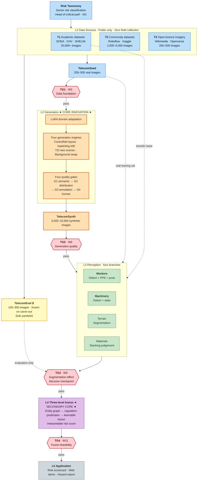
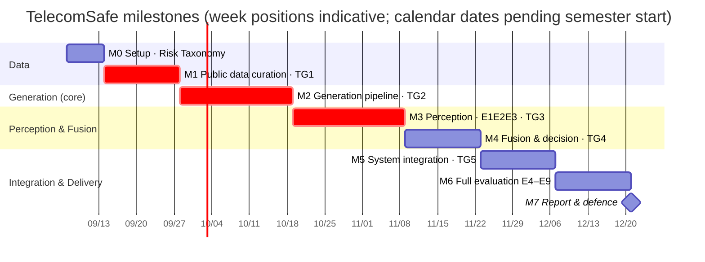

# TelecomSafe — Technological Roadmap

> Document version: **v2.0 (simplified)** ｜ Generated: 2026-08-19 ｜ Revised: 2026-08-24
> Chinese counterpart: [05-技术路线图-CN.md](05-技术路线图-CN.md)
> Roles: [06 Teamwork Allocation](06-Teamwork-Allocation-EN.md) ｜ Detailed schedule: [01 Technical Plan & Milestones](01-Technical-Plan-and-Milestones-EN.md)

**This document governs technology choices and fallbacks; `01` governs the schedule.** Use them together.

---

## One-Page Summary

| | |
|---|---|
| **Innovation bets** | L2 generative augmentation (core) + L4 information fusion (secondary) |
| **Kept conservative** | L3 perception and L5 system layers use mature solutions only — no technical adventures |
| **Three must-pass gates** | TG1 data foundation (W3) → TG2 generation quality (W6) → TG3 augmentation effectiveness (W9) |
| **Critical path** | Risk Taxonomy → public data curation → LoRA → generation engines → **experiment E3** |
| **Largest risks** | ① only 200–500 real telecom images ② negative transfer from synthetic data ③ four-dimension scope too large |
| **Safest bet** | The inpainting route: inherited annotation + minimal domain gap; it does not fail under any circumstances |

---

## 1. Master Technical Flow



**How to read it**

- 🟠 **Orange is where the innovation lives**: the L2 generation layer, and the only part that must be built from scratch
- 🟡 **Yellow TelecomEval has exactly one outgoing edge**: evaluation only, never flowing back into training or generation. Every experimental conclusion depends on this
- 🔴 **Red diamonds are decision gates**: failing one triggers a downgrade path (§3) rather than forcing ahead
- Dashed edges are **auxiliary data flows**; solid edges are the **main chain**

---

## 2. Three Horizons

| | H1 · MVP loop<br/>W1–W9 | H2 · Full framework<br/>W10–W16 | H3 · Extension<br/>Post-project |
|---|---|---|---|
| **Goal** | "It runs" | "It can be evaluated" | "It can be published / deployed" |
| **Data** | T1+T2 transfer · T3 curation 200–500 | + terrain/material subsets | + public dataset release |
| **Generation** | SDXL+LoRA · T2I+Inpainting · gates G1+G3 | + full ControlNet · gates G1–G4 | + video generation |
| **Perception** | Single Workers branch | Four branches + skeleton action | + two-stream fusion |
| **Fusion** | 5 hard rules, direct | Three-level fusion + GNN | + D-S evidence theory control |
| **System** | CLI scripts | FastAPI + web demo | + edge deployment |

> ⚠️ **Do not enter H2 if H1 has not been met.** If E3 at W9 shows no gain from synthetic data, adding four-dimension perception only magnifies the problem. Better to spend two more weeks in H1.

---

## 3. Decision Gates and Downgrade Paths

```mermaid
flowchart LR
    classDef gate fill:#ffcdd2,stroke:#c62828,stroke-width:2px,color:#3e1416
    classDef pass fill:#c8e6c9,stroke:#2e7d32,stroke-width:1px,color:#1b3a1e
    classDef down fill:#eceff1,stroke:#78909c,stroke-width:1px,color:#263238

    TG1{{"TG1 · W3<br/>Seed ≥ 200<br/>Eval ≥ 150 frozen"}}:::gate
    TG2{{"TG2 · W6<br/>FID &lt; 50<br/>Realism ≥ 3.0"}}:::gate
    TG3{{"TG3 · W9<br/>E3 − E2 ≥ 2.0 mAP"}}:::gate
    TG4{{"TG4 · W11<br/>Risk-level Acc ≥ 0.70"}}:::gate
    TG5{{"TG5 · W13<br/>End-to-end &lt; 3s"}}:::gate
    DONE["M7 · W16 Delivery"]:::pass

    D1["<b>D1</b> Reframe as work-at-height /<br/>tower-type construction"]:::down
    D2["<b>D2</b> Keep only Inpainting<br/>+ background swap"]:::down
    D3["<b>D3</b> Narrow claim to<br/>long-tail class gains"]:::down
    D4["<b>D4</b> Drop learnable layer<br/>pure rule fusion"]:::down
    D5["<b>D5</b> Scripts + screen recording<br/>instead of web UI"]:::down

    TG1 -->|pass| TG2 -->|pass| TG3 -->|pass| TG4 -->|pass| TG5 -->|pass| DONE
    TG1 -.fail.-> D1 -.continue.-> TG2
    TG2 -.fail.-> D2 -.continue.-> TG3
    TG3 -.fail.-> D3 -.continue.-> TG4
    TG4 -.fail.-> D4 -.continue.-> TG5
    TG5 -.fail.-> D5 -.continue.-> DONE
```



**Every gate has a fallback, so there is no single point of failure.** Criteria and actions:

| Gate | Timing | Criteria | Action on failure |
|---|---|---|---|
| **TG1** Data foundation | End W3 | TelecomSeed ≥ 200 annotated; TelecomEval ≥ 150 carved out and frozen | < 100 images → **D1**: abandon the sector-specific positioning; reframe as work-at-height / tower-type construction, with the test set drawn from work-at-height subsets of T1/T2 |
| **TG2** Generation quality | End W6 | FID(synthetic, real) < 50; human realism ≥ 3.0/5; gate retention ≥ 40% | FID > 70 → **D2**: keep only inpainting and background replacement — the two routes that edit real images, whose domain gap is inherently minimal and which almost never fail |
| **TG3** Augmentation effect | End W9 | E3 improves mAP over E2 by ≥ 2.0 | No gain → **D3**: first check label noise and mixing ratio; if still ineffective, narrow the claim to "improves long-tail rare-class performance" and state honestly that overall performance did not improve |
| **TG4** Fusion feasibility | End W11 | Risk-level accuracy ≥ 0.70 against 200 expert-annotated images | < 0.55 → **D4**: first check inter-annotator agreement (Kappa < 0.5 means the annotation, not the model, is the problem); otherwise drop level 3 and keep pure rules, which are steadier and fully interpretable |
| **TG5** System integration | End W13 | End-to-end runs; single-image inference < 3 s | Fail → **D5**: scripts, rendered output and a screen recording instead of a web interface (affects only the defence presentation, not the academic conclusions) |

**Three further fallbacks** (not tied to a gate):

| ID | Trigger | Action |
|---|---|---|
| **D6** | No video data | Replace action recognition with single-frame pose + rules (e.g. arm angle for climbing) |
| **D7** | VRAM < 16 GB | SD 1.5 instead of SDXL; YOLOv11-s instead of -m; 8-bit quantisation |
| **D8** | More than 2 weeks behind | Drop Terrain + Materials; deliver Workers + Machinery only |

> 💡 **On D3**: this is not failure but confining the claim to what is actually true. Kim & Yi (2024) reached only ~64% mAP with purely synthetic data, so the domain gap is real. A limited but honest finding is far more credible than a forced claim of across-the-board improvement.
>
> 💡 **On D8**: document [01 §5 R7](01-Technical-Plan-and-Milestones-EN.md) already recommends focusing on two dimensions from the outset. Follow that and D8 becomes unnecessary.

---

## 4. Timeline



> Dates in the chart express **relative week positions only**; the start week is a placeholder. Once the academic calendar is confirmed, substitute real dates and update the Summary Milestones table in [07 Project Charter](07-Project-Charter-EN.md).
> The critical items M1 → M2 → M3 are marked in red: a delay in any of them delays everything downstream.

---

## 5. Critical Path and Risk Concentration

**Critical path**: `Risk Taxonomy → annotation guideline → public data curation → LoRA → generation engines → synthetic data → experiment E3`

Three commonly underestimated points:

1. **The Risk Taxonomy is not "a list of categories"** but a definition of **decidable criteria** per risk (what counts as "poorly stored"? which height-to-width ratio?). Without this, annotation, generation and evaluation each mean something different.
2. **Searching and screening T3 openly licensed imagery is the only step compute cannot accelerate.** Start it in parallel in W1. ⚠️ **Source URL and licence attribution must be recorded at the moment of collection** — reconstructing them later is close to impossible, and it is a hard obligation of CC BY / CC BY-SA.
3. **Expert risk annotation (the ground truth for TG4) can be done early in parallel.** It is not on the critical path but is routinely deferred until TG4 becomes unmeasurable. Start recruiting annotators in W8.

**Technology maturity and where to put your strongest people**:

| Confidence | Technology | Allocation |
|---|---|---|
| 🟢 **Mature** | YOLOv11 detection, SDXL+LoRA, SD Inpainting, SAM 2, Grounding DINO | Assign to less experienced members; use off-the-shelf solutions directly |
| 🟡 **Medium** | ControlNet-Seg layout control, ST-GCN++ skeleton action, gate threshold calibration, rule predicate base | Reserve debugging time; the effort of programmatically generating ControlNet layout maps is routinely underestimated |
| 🔴 **Novel** | Three-level information fusion, terrain segmentation, material storage judgement | **Put the strongest people here**; the latter two have no public data and subjective class definitions, and are the first candidates for D8 |

---

## 6. Post-Project Extensions (H3)

Ordered by return on effort:

| Priority | Direction | Note | Effort |
|---|---|---|---|
| ⭐⭐⭐⭐⭐ | **Release the TelecomSynth dataset** | Synthetic data involves no real individual's privacy, so release is unobstructed; a dataset is itself a citable contribution | 1–2 weeks |
| ⭐⭐⭐⭐⭐ | **Submit to *Automation in Construction*** | The field's principal venue, already hosting comparable work by Kim & Yi and Lee et al.; strong topical match | 4–6 weeks |
| ⭐⭐⭐⭐ | VLM natural-language risk reports | Integrate Qwen2.5-VL; strong demonstration value, low effort | 1 week |
| ⭐⭐⭐⭐ | Complete video behaviour recognition | Restores what was cut if D6 was taken | 3–4 weeks |
| ⭐⭐⭐ | UAV viewpoint / edge deployment | High engineering value, limited academic contribution | 3–4 weeks |

---

## 7. Gate Meeting Checklist

Self-check before every TG meeting:

```
□ Have the gate criteria been measured (not estimated)?
□ Are the actions for both outcomes (pass / fail) agreed by the team?
□ If a downgrade is triggered, has the effort of the corresponding D path been assessed?
□ Is any task on the critical path delayed? By how long?
□ Have the conclusions been minuted and pushed to the repository?
□ Has the milestone's ACTUAL completion date been recorded?
  (the report template requires planned vs actual)
```
