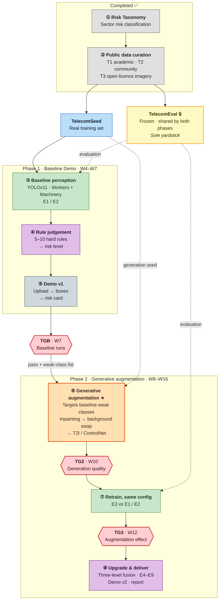
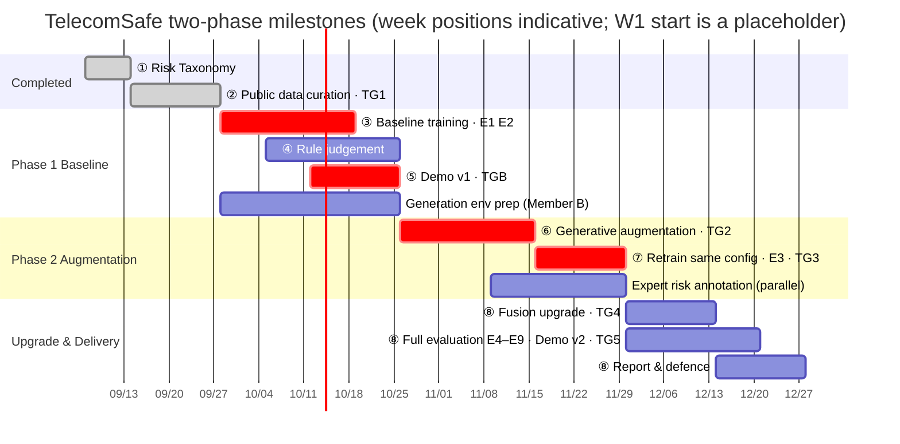

# TelecomSafe — Technological Roadmap

> Document version: **v3.0 (baseline first)** ｜ Generated: 2026-08-19 ｜ Revised: 2026-09-28 (two-phase flow on the supervisor's advice: a baseline demo on public data first, generative augmentation moved to phase 2)
> Chinese counterpart: [05-技术路线图-CN.md](05-技术路线图-CN.md)
> Roles: [06 Teamwork Allocation](06-Teamwork-Allocation-EN.md) ｜ Detailed schedule: [01 Technical Plan & Milestones](01-Technical-Plan-and-Milestones-EN.md)

**This document governs technology choices and fallbacks; `01` governs the schedule.** Use them together.

> 🔄 **v3.0 flow change (2026-09-28)**: following discussion with the supervisor, the flow changes from "augment first, then train" to **two phases**:
> - **Phase 1 · Baseline**: using only the public datasets already curated, train perception models, add rule-based judgement and a small demo — deliver a working product first
> - **Phase 2 · Augmentation**: add generative augmentation on top of the baseline and measure the gain on the same test set with the same training configuration
>
> ① Define and ② Source **have been completed offline**. The schedules in documents 01 / 03 / 06 / 07 have been synchronised to this flow.

---

## One-Page Summary

| | |
|---|---|
| **Where we are** | ①② complete → entering phase 1, step ③ baseline training |
| **Phase 1 goal** | Public data only; a working Baseline Demo v1 (detection + rule-based risk judgement + interface) by **end of W7** |
| **Phase 2 goal** | Generative augmentation, shown to beat the baseline on the same TelecomEval (E3 vs E1/E2) |
| **Innovation bets** | Unchanged: L2 generative augmentation (core) + L4 information fusion (secondary), now deferred to phase 2 |
| **Kept conservative** | L3 perception and L5 system use mature solutions only (YOLOv11 + Gradio) — no technical adventures |
| **Decision gates** | TG1 data ✅ → **TGB baseline (W7)** → TG2 generation quality (W10) → TG3 augmentation effect (W12) → TG4 fusion (W14) → TG5 system (W15) |
| **Largest risks** | ① the baseline configuration or test set changes mid-project, so phase 2 cannot be compared fairly ② inconsistent labels across source datasets contradict each other once merged ③ the team stalls after the demo and augmentation never properly starts |

---

## 0. Why Baseline First

| Benefit | Explanation |
|---|---|
| **A deliverable early** | Whatever the generation results in phase 2, the project already has a product to demonstrate, sharply lowering overall risk |
| **The baseline was needed anyway** | The planned E1 (real data only) and E2 (+ conventional augmentation) *are* the baseline; doing them first wastes nothing |
| **Targeted augmentation** | Per-class error analysis of the baseline shows **which classes are weakest**; phase 2 generates data for those classes instead of generating blindly |
| **Demo framework reused** | Phase 2 only swaps the model weights; the interface, rules and inference flow all carry over |

> ⚠️ **Precondition**: the **test set and training configuration must be fixed at the start of phase 1**, or the phase 2 comparison does not hold (see [§2.3](#23-three-hard-constraints-linking-the-two-phases)).

---

## 1. Master Technical Flow


```mermaid
flowchart TB
    classDef done fill:#e0e0e0,stroke:#616161,stroke-width:1px,color:#212121
    classDef data fill:#bbdefb,stroke:#1565c0,stroke-width:1px,color:#0d1b2a
    classDef core fill:#ffe0b2,stroke:#e65100,stroke-width:2px,color:#3e2723
    classDef perc fill:#c8e6c9,stroke:#2e7d32,stroke-width:1px,color:#1b3a1e
    classDef fuse fill:#e1bee7,stroke:#6a1b9a,stroke-width:1px,color:#2e1437
    classDef gate fill:#ffcdd2,stroke:#c62828,stroke-width:2px,color:#3e1416
    classDef app fill:#cfd8dc,stroke:#455a64,stroke-width:1px,color:#1c2529
    classDef eval fill:#fff9c4,stroke:#f9a825,stroke-width:2px,color:#3e3000

    subgraph P0["Completed ✅"]
        direction LR
        TAX["<b>① Risk Taxonomy</b><br/>Sector risk classification"]:::done
        DATA["<b>② Public data curation</b><br/>T1 academic · T2 community<br/>T3 open-licence imagery"]:::done
        TAX --> DATA
    end

    SEED["<b>TelecomSeed</b><br/>Real training set"]:::data
    EVAL["<b>TelecomEval</b> 🔒<br/>Frozen · shared by both phases<br/><i>Sole yardstick</i>"]:::eval

    subgraph PA["Phase 1 · Baseline Demo · W4–W7"]
        direction LR
        BASE["<b>③ Baseline perception</b><br/>YOLOv11 · Workers + Machinery<br/>E1 / E2"]:::perc
        RULE["<b>④ Rule judgement</b><br/>5–10 hard rules<br/>→ risk level"]:::fuse
        DEMO["<b>⑤ Demo v1</b><br/>Upload → boxes<br/>→ risk card"]:::app
        BASE --> RULE --> DEMO
    end

    TGB{{"<b>TGB</b> · W7<br/>Baseline runs"}}:::gate

    subgraph PB["Phase 2 · Generative augmentation · W8–W16"]
        direction LR
        GEN["<b>⑥ Generative augmentation</b> ★<br/>Targets baseline weak classes<br/>Inpainting → background swap<br/>→ T2I / ControlNet"]:::core
        TG2{{"<b>TG2</b> · W10<br/>Generation quality"}}:::gate
        RETRAIN["<b>⑦ Retrain, same config</b><br/>E3 vs E1 / E2"]:::perc
        TG3{{"<b>TG3</b> · W12<br/>Augmentation effect"}}:::gate
        UP["<b>⑧ Upgrade & deliver</b><br/>Three-level fusion · E4–E9<br/>Demo v2 · report"]:::fuse
        GEN --> TG2 --> RETRAIN --> TG3 --> UP
    end

    DATA --> SEED
    DATA --> EVAL
    SEED --> BASE
    DEMO --> TGB
    TGB -->|pass + weak-class list| GEN
    SEED -.generation seed.-> GEN
    EVAL -.evaluation.-> BASE
    EVAL -.evaluation.-> RETRAIN
```

**How to read it**

- ⚪ **Grey is already done**: ① Define and ② Source were completed offline
- 🟢 **Phase 1 uses only mature technology**: YOLOv11 detection + rules + a Gradio interface, aimed at getting something running fast
- 🟠 **Orange is where the innovation lives**: generative augmentation, now in phase 2 and driven by the baseline's weak-class list
- 🟡 **Yellow TelecomEval has evaluation edges only**: one copy shared by both phases, never flowing back into training or generation
- 🔴 **Red diamonds are decision gates**: failing one triggers a downgrade path (§4) rather than forcing ahead

---

## 2. Step-by-Step Walkthrough and Overview

### 2.1 The Whole Flow in One Line

**Build a small working product from the public data we already have, then make it better with generative augmentation.**


```mermaid
flowchart LR
    classDef done fill:#e0e0e0,stroke:#616161,stroke-width:1px,color:#212121
    classDef s fill:#e3f2fd,stroke:#1565c0,stroke-width:1px,color:#0d1b2a
    classDef core fill:#ffe0b2,stroke:#e65100,stroke-width:2px,color:#3e2723
    classDef out fill:#c8e6c9,stroke:#2e7d32,stroke-width:1px,color:#1b3a1e

    S1["<b>① Define</b> ✅<br/>Risk Taxonomy"]:::done
    S2["<b>② Source</b> ✅<br/>Curate public data"]:::done

    subgraph A["Phase 1 · Baseline"]
        direction LR
        S3["<b>③ Learn</b><br/>Train baseline<br/><i>W4–W6</i>"]:::s
        S4["<b>④ Judge</b><br/>Rules → risk level<br/><i>W5–W7</i>"]:::s
        S5["<b>⑤ Demo v1</b><br/>Baseline product<br/><i>W6–W7</i>"]:::out
        S3 --> S4 --> S5
    end

    subgraph B["Phase 2 · Augmentation"]
        direction LR
        S6["<b>⑥ Synthesise</b> ★<br/>Generative augmentation<br/><i>W8–W10</i>"]:::core
        S7["<b>⑦ Compare</b> ★<br/>Retrain, same config<br/><i>W11–W12</i>"]:::core
        S8["<b>⑧ Upgrade + deliver</b><br/>Fusion · experiments · Demo v2<br/><i>W13–W16</i>"]:::out
        S6 --> S7 --> S8
    end

    S1 --> S2 --> S3
    S5 --> S6
```

**Against the v2.1 flow**:

| | v2.1 flow | v3.0 flow |
|---|---|---|
| **Order** | ① → ② → ③ Synthesise → ④ Learn → ⑤ Judge → ⑥ Deliver | ① → ② → **③ Learn → ④ Judge → ⑤ Demo v1** → ⑥ Synthesise → ⑦ Compare → ⑧ Upgrade & deliver |
| **First demonstrable result** | Around W13 | **W7** |
| **Generative augmentation** | W4–W6, before training, covering every class blindly | W8–W10, after the baseline, **targeting the weakest classes** |
| **Information fusion** | All three levels at once | Phase 1 uses rules only (levels 1–2); phase 2 adds the learnable layer |
| **If generation underperforms** | Training, fusion and the demo all suffer | Only phase 2 is affected; the Baseline Demo still ships |

> 💡 **Two principles that still hold**
> 1. **④ Judge cannot be skipped.** Perception models output a pile of isolated detection boxes; the brief asks us to `accurately appraise the potential risks`. Even the baseline needs a rule layer that turns boxes into a risk level, or the deliverable is only a detector.
> 2. **Experiments outweigh the interface.** Demo v1 is the phase 1 deliverable, but the project title is a *generative image-based learning framework* — **the phase 2 E3 comparison is the reason the project exists**.

---

### 2.2 Each Step in Detail

#### ① Define · Risk Taxonomy ✅ Completed

> **Status**: completed offline ｜ **Owner**: Member A

**To do**: commit the final taxonomy to the repository (suggested `configs/taxonomy.yaml`, listing every class name and its decision criterion). It is the class list for ③ and the rule source for ④; all three must reference the same file.

#### ② Source · Curate Public Data ✅ Completed

> **Status**: completed offline ｜ **Owner**: Member A (everyone assists)

Before entering phase 1, confirm these three are in place:

- 🔒 **TelecomEval is carved out and frozen** — the precondition for any phase 2 comparison; it must **never** change from here on
- `licence_manifest.csv` records source and licence per T3 image (a hard obligation of CC BY / CC BY-SA)
- Actual TG1 image counts (TelecomSeed / TelecomEval) are recorded in the repository; the report needs planned vs actual

#### ③ Learn · Train the Baseline Perception Model

> **In**: TelecomSeed + T1/T2 public data ｜ **Out**: baseline weights + E1/E2 results + per-class error analysis
> **When**: W4–W6 ｜ **Owner**: Member C (workers) + Member D (machinery) ｜ **Gate**: TGB

**Scope**: **Workers + Machinery** only (effectively applying D8 from the outset). Terrain and Materials have no ready public data and subjective class definitions; add them in phase 2 if time allows.

**How**:

1. **Unify classes**: source datasets name labels inconsistently (`helmet` / `hardhat` / `Hardhat`, `NO-Hardhat` / `no_helmet`, …). Before merging, write a **mapping table** onto the taxonomy classes. Skip this and the model learns contradictory labels
2. **Model**: YOLOv11 (Ultralytics), fine-tuned from COCO-pretrained weights. For the baseline, **one detector** outputting people, PPE and machinery classes is enough; no need to split into branches
3. **Two experiments**:

| Experiment | Training data | Purpose |
|---|---|---|
| **E1** | Real data only, **all built-in augmentation off** | Pure baseline |
| **E2** | Real data + conventional augmentation (YOLO defaults: mosaic / flip / HSV, etc.) | **What phase 2 must beat** |

> ⚠️ **Ultralytics enables mosaic, flipping and HSV jitter by default.** E1 must explicitly set `mosaic`, `fliplr`, `hsv_h/s/v`, `scale`, `translate` and similar to 0, otherwise E1 and E2 are effectively identical.

4. **Per-class error analysis**: on TelecomEval, report AP per class and the confusion matrix, and list the **3–5 weakest classes** — that list is phase 2's generation target
5. **Fix the configuration**: model size, input size, epochs, random seed and data split all go into `configs/baseline.yaml`, committed. **Phase 2's E3 must use the same file and change only the training data**

#### ④ Judge · Rules Produce a Risk Level

> **In**: detection boxes (class + coordinates + confidence) ｜ **Out**: a risk level per image (low / medium / high) + the list of triggered rules
> **When**: W5–W7 (in parallel with ③) ｜ **Owner**: Member E ｜ **Gate**: TGB

Only the **first two levels** of the original three-level fusion (entity relations + rules); no learnable layer:

```
Example rules (box geometry only; plain Python is enough)
R1  person AND no helmet                         -> medium risk
R2  person AND no vest                           -> low risk
R3  person on tower / at height AND no harness   -> high risk
R4  person-machinery distance < safe radius      -> high risk
                                                    (scale estimated from person box height)
...
Image risk level = highest level among triggered rules
```

- Rules come straight from the taxonomy, **each labelled with its regulatory source** (OSHA / GB, etc.); 5–10 rules are enough
- For "no helmet", prefer the `NO-Hardhat` class many datasets already provide over inferring "no helmet box found"
- **Why it can run in parallel**: rules depend only on the **format** of detections (class names + boxes), so they can be developed and tested against hand-written mock detections before ③'s model is trained

#### ⑤ Demo v1 · The Baseline Product

> **In**: weights from ③ + rules from ④ ｜ **Out**: a small working demo
> **When**: W6–W7 ｜ **Owner**: Member E ｜ **Gate**: TGB

- **Tool**: Gradio (an interface in a few dozen lines) or Streamlit
- **Features**: upload an image → overlay detection boxes → risk-level card → triggered rules (with regulatory source)
- **Out of scope**: user accounts, databases, video streams, deployment acceleration — none of these earn marks
- **Structure**: split internally into `detect(image)` → `judge(boxes)` → `render(result)`; phase 2 swaps only the `detect` weights

#### ⑥ Synthesise · Generative Augmentation ★ Core innovation ★

> **In**: TelecomSeed + the baseline weak-class list ｜ **Out**: TelecomSynth (annotated synthetic images)
> **When**: W8–W10 ｜ **Owner**: Member B (lead) + Member A (deputy) ｜ **Gate**: TG2

**What changes from the original plan**: no more blind coverage of every class. **Targets come from ③'s error analysis**, and data is generated only for the weakest classes.

Four routes, **advanced from lowest to highest risk**:

| Order | Route | How | Where the annotation comes from |
|---|---|---|---|
| 1 | **Inpainting edit** | Erase the helmet from a real image | Original annotation inherited; only the label flips |
| 2 | **Background swap** | Convert to rain, night or fog | Annotation entirely unchanged |
| 3 | **T2I new scenes** | Text-describe a rare hazardous scene | Grounding DINO auto-labelling + check |
| 4 | **ControlNet layout** | Draw a semantic layout map, then generate | The layout map *is* the annotation |

The first two edit real images, so their domain gap is minimal and they almost never fail; the last two proceed as time allows. Everything generated passes the **four quality gates** (semantic / distributional / annotation / human); full design in [document 03](03-Generative-Augmentation-Pipeline-EN.md).

> 💡 **Member B should not sit idle in phase 1**: during W4–W7, set up the generation environment in advance (SDXL + LoRA + inpainting trial runs). Starting from scratch in W8 squeezes phase 2 badly.

#### ⑦ Compare · Retrain with the Same Configuration ★ Decisive checkpoint ★

> **In**: TelecomSeed + TelecomSynth ｜ **Out**: E3 results + comparison table against E1/E2 ｜ **Demo v2**
> **When**: W11–W12 ｜ **Owner**: Member C + Member D ｜ **Gate**: TG3

| Experiment | Training data | Purpose |
|---|---|---|
| E1 | Real data only (done in phase 1) | Baseline |
| E2 | + conventional augmentation (done in phase 1) | Rules out "any extra data helps" |
| **E3** | **+ generative augmentation** | **Proves this project's method works** |

- Use **the same** `configs/baseline.yaml`, change only the training data, and evaluate on **the same** TelecomEval
- Beyond overall mAP, focus on the gain for the **targeted weak classes** — the most persuasive number in phase 2
- Once it passes, swap the new weights into the demo to get **Demo v2**

#### ⑧ Upgrade and Deliver

> **In**: all models and experimental results ｜ **Out**: full experiments + Demo v2 + the EE6008 report and defence
> **When**: W13–W16 ｜ **Owner**: Member E (system) + everyone (experiments and report) ｜ **Gates**: TG4, TG5

| | Content | Weight |
|---|---|---|
| **Fusion upgrade** | Add the level-3 learnable fusion on top of the phase 1 rules (optional; if TG4 fails, keep pure rules) | Secondary innovation |
| **Full experiments** | E4–E9: domain gap, ratio curve, long-tail classes, **robustness (E7)**, fusion ablation, cross-site generalisation | ⭐ **The real academic deliverable** |
| **Demo v2 + report** | Swap in the augmented weights; the report presents the full baseline → augmentation comparison | For the defence |

**Why experiments outweigh the demo**: the brief asks to `develop and evaluate` and states `high effectiveness and robustness` explicitly. Effectiveness is proven by E3; robustness by E7. **Many student projects pour all their time into the interface and omit E7 — that is where marks are lost.**

---

### 2.3 Three Hard Constraints Linking the Two Phases

The two-phase plan only works if **phase 2's E3 can be compared fairly with phase 1's E1/E2**. So these three things are **frozen** once phase 1 sets them:

| What is fixed | Why | How |
|---|---|---|
| **The TelecomEval test set** | Change the test set and E3 is no longer comparable with E1/E2 | Freeze on carve-out; record a hash of the file list; never used in training, LoRA or generation conditioning |
| **The baseline training configuration** | Change the configuration and any gain may come from tuning, not augmentation | `configs/baseline.yaml` is read-only once committed; E3 changes only the training data |
| **The demo's three-stage interface** | Change the interface and phase 2 has to rewrite the demo | Decouple `detect` → `judge` → `render`; phase 2 swaps only the weights |

**The one thing that can be brought forward in parallel** is the expert risk annotation needed by ⑧ (200 images assigned risk levels, the ground truth for TG4). It is not on the critical path, but it is routinely deferred until TG4 becomes unmeasurable. Start recruiting annotators in W10.

---

### 2.4 Common Misconceptions

| Misconception | Reality |
|---|---|
| "Once the baseline demo works, the project is done" | The baseline is only the starting point. **Generative augmentation is why the project exists**; without phase 2's E3 comparison, the project is merely "trained a detector on public data" |
| "Skipping augmentation for now means dropping it" | It is deferred and made more targeted, not dropped. The baseline's error analysis is exactly the input phase 2 needs |
| "Generating data just means flipping and cropping images" | That is **conventional augmentation** (E2). This project uses diffusion models to **create scenes that never existed**; the two stand in contrast as E2 versus E3 and must not be conflated |
| "More synthetic data is always better" | ❌ Unfiltered synthetic data **degrades** performance (negative transfer). That is why the four quality gates exist: better to discard half than to pollute the training set |

---

## 3. Three Horizons

| | H1 · Baseline demo<br/>W1–W7 | H2 · Full generative framework<br/>W8–W16 | H3 · Extension<br/>Post-project |
|---|---|---|---|
| **Goal** | "It runs and can be demonstrated" | "It proves the method and can be evaluated" | "It can be published / deployed" |
| **Data** | T1+T2+T3 public data (curated) | + TelecomSynth synthetic data | + public dataset release |
| **Generation** | None | Inpainting + background swap → T2I / ControlNet · gates G1–G4 | + video generation |
| **Perception** | Single YOLOv11 detector · Workers + Machinery | Retrain with the same config; add Terrain / Materials / skeleton action if time allows | + two-stream fusion |
| **Fusion** | 5–10 hard rules, direct | + level-3 learnable fusion (optional) | + D-S evidence theory control |
| **System** | Gradio Demo v1 | Demo v2 (weights swapped) | + edge deployment |

> ⚠️ **H1's baseline numbers are H2's reference point.** When H1 closes, archive the E1/E2 results, per-class AP, the configuration file and the TelecomEval version together.

---

## 4. Decision Gates and Downgrade Paths


```mermaid
flowchart LR
    classDef done fill:#e0e0e0,stroke:#616161,stroke-width:1px,color:#212121
    classDef gate fill:#ffcdd2,stroke:#c62828,stroke-width:2px,color:#3e1416
    classDef pass fill:#c8e6c9,stroke:#2e7d32,stroke-width:1px,color:#1b3a1e
    classDef down fill:#eceff1,stroke:#78909c,stroke-width:1px,color:#263238

    TG1{{"TG1 · W3 ✅<br/>Data foundation"}}:::done
    TGB{{"TGB · W7<br/>Demo v1 runs<br/>E1/E2 recorded"}}:::gate
    TG2{{"TG2 · W10<br/>FID &lt; 50<br/>Realism ≥ 3.0"}}:::gate
    TG3{{"TG3 · W12<br/>E3 − E2 ≥ 2.0 mAP"}}:::gate
    TG4{{"TG4 · W14<br/>Risk-level Acc ≥ 0.70"}}:::gate
    TG5{{"TG5 · W15<br/>Demo v2 &lt; 3s"}}:::gate
    DONE["W16 Delivery"]:::pass

    DB["<b>DB</b> Workers only<br/>+ script output"]:::down
    D2["<b>D2</b> Keep only Inpainting<br/>+ background swap"]:::down
    D3["<b>D3</b> Narrow claim to<br/>weak-class gains"]:::down
    D4["<b>D4</b> Keep phase 1<br/>pure rules"]:::down
    D5["<b>D5</b> Reuse Demo v1<br/>+ screen recording"]:::down

    TG1 --> TGB -->|pass| TG2 -->|pass| TG3 -->|pass| TG4 -->|pass| TG5 -->|pass| DONE
    TGB -.fail.-> DB -.continue.-> TG2
    TG2 -.fail.-> D2 -.continue.-> TG3
    TG3 -.fail.-> D3 -.continue.-> TG4
    TG4 -.fail.-> D4 -.continue.-> TG5
    TG5 -.fail.-> D5 -.continue.-> DONE
```

**Every gate has a fallback, so there is no single point of failure.** Criteria and actions:

| Gate | Timing | Criteria | Action on failure |
|---|---|---|---|
| **TG1** Data foundation | End W3 | ✅ **Passed (offline)** — record the actual TelecomSeed / TelecomEval counts | — |
| **TGB** Baseline | End W7 | Demo v1 runs end-to-end; E1/E2 mAP and per-class AP on TelecomEval recorded; `configs/baseline.yaml` committed | Fail → **DB**: shrink to the Workers dimension, with scripts and rendered output instead of an interface; phase 2 slips by at most one week |
| **TG2** Generation quality | End W10 | FID(synthetic, real) < 50; human realism ≥ 3.0/5; gate retention ≥ 40% | FID > 70 → **D2**: keep only inpainting and background replacement, the two routes that edit real images (inherently minimal domain gap) |
| **TG3** Augmentation effect | End W12 | E3 improves mAP over E2 by ≥ 2.0 (overall or on the targeted weak classes) | No gain → **D3**: first check label noise and mixing ratio; if still ineffective, narrow the claim to "improves weak / long-tail class performance" and state honestly that overall performance did not improve |
| **TG4** Fusion feasibility | End W14 | Risk-level accuracy ≥ 0.70 against 200 expert-annotated images | < 0.55 → **D4**: first check inter-annotator agreement (Kappa < 0.5 means the annotation, not the model, is the problem); otherwise keep the phase 1 pure-rule judgement, which is fully interpretable |
| **TG5** System integration | End W15 | Demo v2 runs end-to-end; single-image inference < 3 s | Fail → **D5**: reuse Demo v1 plus a screen recording (affects only the defence presentation, not the academic conclusions) |

**Three further fallbacks** (not tied to a gate):

| ID | Trigger | Action |
|---|---|---|
| **D6** | No video data | Replace action recognition with single-frame pose + rules (e.g. arm angle for climbing) |
| **D7** | VRAM < 16 GB | SD 1.5 instead of SDXL; YOLOv11-s instead of -m; 8-bit quantisation |
| **D8** | More than 2 weeks behind | Drop Terrain + Materials; deliver Workers + Machinery only — **from v3.0, phase 1 uses this scope by default** |

> 💡 **On D3**: this is not failure but confining the claim to what is actually true. Kim & Yi (2024) reached only ~64% mAP with purely synthetic data, so the domain gap is real. In v3.0, phase 2 already targets weak classes, so "a significant gain on weak classes" is a defensible finding in its own right.
>
> 💡 **The former D1 (reframe as a generic scenario if TG1 fails)**: TG1 has passed, so D1 is no longer needed.

---

## 5. Timeline


```mermaid
gantt
    title TelecomSafe two-phase milestones (week positions indicative; W1 start is a placeholder)
    dateFormat YYYY-MM-DD
    axisFormat %m/%d

    section Completed
    ① Risk Taxonomy                 :done, m0, 2026-09-07, 7d
    ② Public data curation · TG1    :done, m1, 2026-09-14, 14d

    section Phase 1 Baseline
    ③ Baseline training · E1 E2     :crit, a1, 2026-09-28, 21d
    ④ Rule judgement                :a2, 2026-10-05, 21d
    ⑤ Demo v1 · TGB                 :crit, a3, 2026-10-12, 14d
    Generation env prep (Member B)  :b0, 2026-09-28, 28d

    section Phase 2 Augmentation
    ⑥ Generative augmentation · TG2 :crit, b1, 2026-10-26, 21d
    ⑦ Retrain same config · E3 · TG3 :crit, b2, 2026-11-16, 14d
    Expert risk annotation (parallel) :b3, 2026-11-09, 21d

    section Upgrade & Delivery
    ⑧ Fusion upgrade · TG4          :c1, 2026-11-30, 14d
    ⑧ Full evaluation E4–E9 · Demo v2 · TG5 :c2, 2026-11-30, 21d
    ⑧ Report & defence              :c3, 2026-12-14, 14d
```

> Dates are computed from W1 = 2026-09-07 and express **relative week positions only**. Once the academic calendar is confirmed, substitute real dates and update the Summary Milestones table in [07 Project Charter](07-Project-Charter-EN.md).
> The items in red, ③ → ⑤ → ⑥ → ⑦, form the critical path: a delay in any of them delays everything downstream.

---

## 6. Critical Path and Risk Concentration

**Phase 1 critical path**: `Taxonomy ✅ → data curation ✅ → class mapping table → baseline training → Demo v1`
**Phase 2 critical path**: `weak-class list → generation (inpainting first) → quality gates → retrain with the same config → E3`

Four commonly underestimated points:

1. **The class mapping table**: source datasets name labels inconsistently, and they must be aligned to the taxonomy before merging. This is the earliest and most easily overlooked bottleneck in phase 1; make it the first job of W4.
2. **"Fixing" the baseline**: once the configuration, data split, random seed and TelecomEval version are committed, they do not change. Deciding later to "tweak the baseline a bit" leaves the phase 2 comparison impossible to defend.
3. **Starting phase 2**: teams tend to slow down once Demo v1 works. The TGB meeting must settle the weak-class list and the start date for ⑥, and Member B must have the generation environment ready during phase 1.
4. **Expert risk annotation (the ground truth for TG4)**: not on the critical path, but routinely deferred until TG4 becomes unmeasurable. Start recruiting annotators in W10.

**Technology maturity and where to put your strongest people**:

| Confidence | Technology | Allocation |
|---|---|---|
| 🟢 **Mature** | YOLOv11 detection, Gradio, SDXL+LoRA, SD Inpainting, SAM 2, Grounding DINO | Assign to less experienced members; use off-the-shelf solutions directly |
| 🟡 **Medium** | Class mapping and dataset merging, ControlNet-Seg layout control, ST-GCN++ skeleton action, gate threshold calibration, rule predicate base | Reserve debugging time; the effort of programmatically generating ControlNet layout maps is routinely underestimated |
| 🔴 **Novel** | Three-level information fusion (learnable layer), terrain segmentation, material storage judgement | **Put the strongest people here**; the latter two have no public data and subjective class definitions, and are out of scope for phase 1 |

---

## 7. Gate Meeting Checklist

Self-check before every TG meeting:

```
□ Have the gate criteria been measured (not estimated)?
□ Are the actions for both outcomes (pass / fail) agreed by the team?
□ If a downgrade is triggered, has the effort of the corresponding D path been assessed?
□ Is any task on the critical path delayed? By how long?
□ Have TelecomEval and configs/baseline.yaml remained unchanged since phase 1?
□ Have the conclusions been minuted and pushed to the repository?
□ Has the milestone's ACTUAL completion date been recorded?
  (the report template requires planned vs actual)
```

Additional checks at the TGB meeting:

```
□ E1 / E2 mAP and per-class AP archived
□ Weak-class list (3–5 classes) agreed and handed to Member B as the target for ⑥
□ Start date for ⑥ agreed
```
