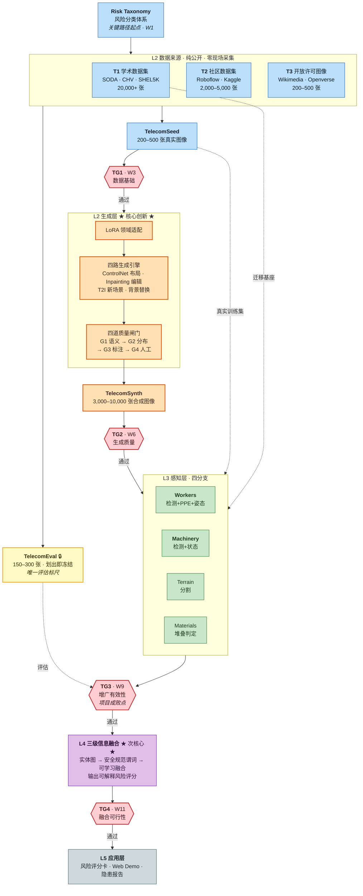
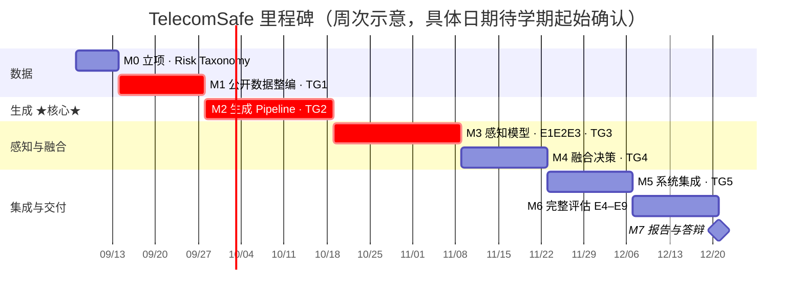

# TelecomSafe 技术路线图

> 文档版本：**v2.0 简化版** ｜ 生成日期：2026-08-19 ｜ 修订：2026-08-24
> 英文对照版：[05-Technological-Roadmap-EN.md](05-Technological-Roadmap-EN.md)
> 分工见 [06 团队分工](06-团队分工-CN.md) ｜ 详细排期见 [01 技术方案与里程碑](01-技术方案与里程碑-CN.md)

**本文管技术选择与退路，`01` 管时间排期。** 两者配合使用。

---

## 一页速览

| | |
|---|---|
| **创新押注** | L2 生成式增广（核心）+ L4 信息融合（次核心） |
| **工程保守** | L3 感知层、L5 系统层一律选成熟方案，不做技术冒险 |
| **必过三门** | TG1 数据基础（W3）→ TG2 生成质量（W6）→ TG3 增广有效性（W9） |
| **关键路径** | Risk Taxonomy → 公开数据整编 → LoRA → 生成引擎 → **E3 实验** |
| **最大风险** | ① 电信真实数据仅 200–500 张 ② 合成数据负迁移 ③ 四维范围过大 |
| **最稳的一手** | Inpainting 路线：标注继承 + 域间隙最小，任何情况下都不会失败 |

---

## 1. 主技术流程图



**读图要点**

- 🟠 **橙色是全项目的创新所在**：L2 生成层，也是唯一必须自研的部分
- 🟡 **黄色 TelecomEval 只有一条出边**：只用于评估，绝不回流到训练或生成。这是所有实验结论成立的前提
- 🔴 **红色菱形是决策门**：不通过就走降级路径（见 §3），不硬推
- 虚线是**辅助数据流**，实线是**主链路**

---

## 2. 三个视野

| | H1 · MVP 闭环<br/>W1–W9 | H2 · 完整框架<br/>W10–W16 | H3 · 延伸<br/>项目后 |
|---|---|---|---|
| **目标** | "能跑通" | "能评估" | "能发表 / 能落地" |
| **数据** | T1+T2 迁移 · T3 整编 200–500 张 | + 地形/材料子集 | + 数据集公开发布 |
| **生成** | SDXL+LoRA · T2I+Inpainting · 闸门 G1+G3 | + ControlNet 全套 · 闸门 G1–G4 | + 视频生成 |
| **感知** | 单分支 Workers | 四分支并行 + 骨架动作 | + 双流融合 |
| **融合** | 5 条硬规则直判 | 三级分层融合 + GNN | + D-S 证据理论对照 |
| **系统** | CLI 脚本 | FastAPI + Web Demo | + 边缘部署 |

> ⚠️ **H1 不达标就不要进 H2**。若 W9 的 E3 实验证明生成数据没有提升，继续堆四维感知只会放大问题。宁可在 H1 多花两周。

---

## 3. 决策门与降级路径

```mermaid
flowchart LR
    classDef gate fill:#ffcdd2,stroke:#c62828,stroke-width:2px,color:#3e1416
    classDef pass fill:#c8e6c9,stroke:#2e7d32,stroke-width:1px,color:#1b3a1e
    classDef down fill:#eceff1,stroke:#78909c,stroke-width:1px,color:#263238

    TG1{{"TG1 · W3<br/>Seed ≥ 200<br/>Eval ≥ 150 冻结"}}:::gate
    TG2{{"TG2 · W6<br/>FID &lt; 50<br/>真实性 ≥ 3.0"}}:::gate
    TG3{{"TG3 · W9<br/>E3−E2 ≥ 2.0 mAP"}}:::gate
    TG4{{"TG4 · W11<br/>风险等级 Acc ≥ 0.70"}}:::gate
    TG5{{"TG5 · W13<br/>端到端 &lt; 3s"}}:::gate
    DONE["M7 · W16 交付"]:::pass

    D1["<b>D1</b> 改为高处作业/<br/>塔架类泛化场景"]:::down
    D2["<b>D2</b> 只留 Inpainting<br/>+ 背景替换"]:::down
    D3["<b>D3</b> 结论收窄为<br/>提升长尾类别"]:::down
    D4["<b>D4</b> 去掉可学习层<br/>纯规则融合"]:::down
    D5["<b>D5</b> 脚本+录屏<br/>替代 Web 界面"]:::down

    TG1 -->|通过| TG2 -->|通过| TG3 -->|通过| TG4 -->|通过| TG5 -->|通过| DONE
    TG1 -.未达标.-> D1 -.继续.-> TG2
    TG2 -.未达标.-> D2 -.继续.-> TG3
    TG3 -.未达标.-> D3 -.继续.-> TG4
    TG4 -.未达标.-> D4 -.继续.-> TG5
    TG5 -.未达标.-> D5 -.继续.-> DONE
```



**每个门都有退路，所以没有单点失败。** 判据与动作：

| 门 | 时点 | 判据 | 未达标动作 |
|---|---|---|---|
| **TG1** 数据基础 | W3 末 | TelecomSeed ≥200 张已标注；TelecomEval ≥150 张已冻结 | <100 张 → **D1**：放弃"电信专用"定位，改为高处作业/塔架类泛化场景，测试集改用 T1/T2 的高处作业子集 |
| **TG2** 生成质量 | W6 末 | FID(合成,真实) < 50；人工真实性 ≥3.0/5；闸门保留率 ≥40% | FID>70 → **D2**：只保留 Inpainting 与背景替换两条基于真实图像编辑的路线（域间隙天然最小，几乎不会失败） |
| **TG3** 增广有效性 | W9 末 | E3 相对 E2 的 mAP 提升 ≥2.0 | 无提升 → **D3**：先查标签噪声与配比；仍无效则把结论收窄为"提升长尾稀有类别性能"，诚实说明整体未提升 |
| **TG4** 融合可行性 | W11 末 | 风险等级 Accuracy ≥0.70（对照 200 张专家标注） | <0.55 → **D4**：先查标注一致性（Kappa<0.5 说明问题在标注不在模型）；否则去掉第 3 级可学习融合，纯规则更稳且完全可解释 |
| **TG5** 系统集成 | W13 末 | 端到端可运行；单图推理 <3 秒 | 未达标 → **D5**：脚本 + 可视化输出 + 录屏演示替代 Web 界面（仅影响答辩观感，不影响学术结论） |

**另外三条备用降级**（不绑定决策门）：

| ID | 触发 | 动作 |
|---|---|---|
| **D6** | 无视频数据 | 行为识别改为单帧姿态 + 规则判定（如手臂角度判断攀爬） |
| **D7** | 显存 < 16GB | SD 1.5 替代 SDXL；YOLOv11-s 替代 -m；8-bit 量化 |
| **D8** | 整体落后 >2 周 | 砍掉 Terrain + Materials，只做 Workers + Machinery |

> 💡 **关于 D3**：这不是失败，而是把结论限定在真实成立的范围内。Kim & Yi (2024) 纯生成数据 mAP 仅约 64%，说明域间隙客观存在。报告一个受限但真实的结论，远比强行宣称全面提升可信。
>
> 💡 **关于 D8**：文档 [01 §5 R7](01-技术方案与里程碑-CN.md) 已建议一开始就主攻两个维度。若照此执行，D8 实际上用不到。

---

## 4. 时间线



> 图中日期仅表示**周次相对关系**，起始周为占位。确认学期日历后请替换为真实日期，并同步更新 [07 项目章程](07-项目章程-CN.md) 的 Summary Milestones 表。
> 标红的 M1→M2→M3 是关键路径，任一延期整体顺延。

---

## 5. 关键路径与风险集中点

**关键路径**：`Risk Taxonomy → 标注规范 → 公开数据整编 → LoRA → 生成引擎 → 合成数据 → E3 实验`

三个容易被低估的点：

1. **Risk Taxonomy 不是"列个类别表"**，而是要定义每个风险的**可判定标准**（什么叫"堆放不当"？高宽比超过多少？）。定义不清，标注、生成、评估三方会各说各话。
2. **T3 开放许可图像的检索筛选是唯一无法靠算力加速的环节**，建议 W1 就并行启动。⚠️ **必须当场逐张记录来源 URL 与许可署名**，事后补记几乎不可能（CC BY / CC BY-SA 的硬性义务）。
3. **专家风险标注（TG4 的 GT）可以提前并行做**，不在关键路径上，但常被拖到最后导致 TG4 无法评估。建议 W8 就开始约人。

**技术成熟度与人力分配**：

| 把握度 | 技术 | 分配建议 |
|---|---|---|
| 🟢 **成熟** | YOLOv11 检测、SDXL+LoRA、SD Inpainting、SAM 2、Grounding DINO | 交给经验较少的成员，直接用现成方案 |
| 🟡 **中等** | ControlNet-Seg 布局控制、ST-GCN++ 骨架动作、闸门阈值标定、规则谓词库 | 需预留调试时间；ControlNet 的布局图程序化生成工作量常被低估 |
| 🔴 **新颖** | 三级信息融合、地形语义分割、材料堆放判定 | **最强人力放这里**；后两项无公开数据、类别定义主观，是 D8 首先砍掉的对象 |

---

## 6. 项目后延伸（H3）

按投入产出比排序：

| 优先级 | 方向 | 说明 | 投入 |
|---|---|---|---|
| ⭐⭐⭐⭐⭐ | **公开 TelecomSynth 数据集** | 合成数据不涉及真人隐私，发布无障碍；数据集本身即可引用贡献 | 1–2 周 |
| ⭐⭐⭐⭐⭐ | **投稿 Automation in Construction** | 该刊是本领域主阵地，已有 Kim & Yi、Lee et al. 等同类工作，选题匹配度高 | 4–6 周 |
| ⭐⭐⭐⭐ | VLM 自然语言风险报告 | 接 Qwen2.5-VL，展示效果好、工作量小 | 1 周 |
| ⭐⭐⭐⭐ | 视频行为识别补全 | 若 H2 走了 D6 降级，此处补回 | 3–4 周 |
| ⭐⭐⭐ | UAV 视角 / 边缘部署 | 工程价值高，学术贡献有限 | 3–4 周 |

---

## 7. 决策门会议检查清单

每次 TG 会议前自查：

```
□ 判据数据是否已实测（不是估计）？
□ 通过 / 未达标 两种结论的动作，团队是否已达成一致？
□ 若触发降级，对应 D 路径的工作量是否已评估？
□ 关键路径上是否有任务延期？延期多久？
□ 会议结论是否已写入纪要并推送到仓库？
□ 里程碑的【实际完成日期】是否已记录？（报告模板要求 Planned vs Actual）
```
