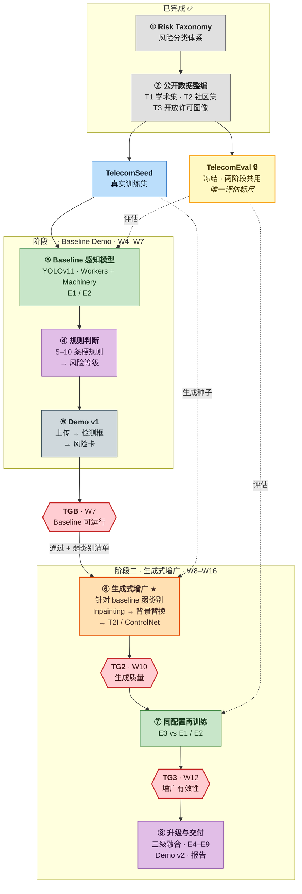
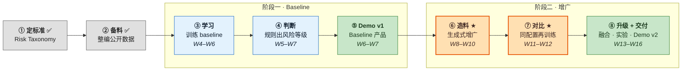
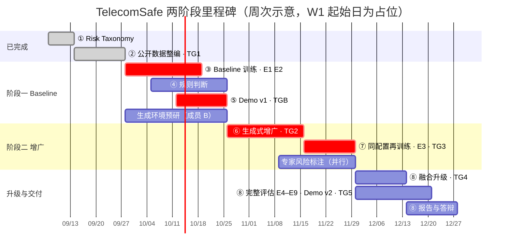

# TelecomSafe 技术路线图

> 文档版本：**v3.0 Baseline 优先** ｜ 生成日期：2026-08-19 ｜ 修订：2026-09-28（按导师建议改为两阶段：先用公开数据做 Baseline Demo，生成式增广移到第二阶段）
> 英文对照版：[05-Technological-Roadmap-EN.md](05-Technological-Roadmap-EN.md)
> 分工见 [06 团队分工](06-团队分工-CN.md) ｜ 详细排期见 [01 技术方案与里程碑](01-技术方案与里程碑-CN.md)

**本文管技术选择与退路，`01` 管时间排期。** 两者配合使用。

> 🔄 **v3.0 流程调整（2026-09-28）**：经与导师沟通，流程由"先增广、再训练"改为**两阶段**：
> - **阶段一 · Baseline**：只用已整编好的公开数据集，训练感知模型 + 规则判断 + 小型 Demo，先交出一个能跑的产品
> - **阶段二 · 增广**：在 baseline 基础上引入生成式增广，用同一测试集、同一训练配置对比提升
>
> ①定标准、②备料**已于线下完成**。文档 01 / 03 / 06 / 07 的排期已同步到本流程。

---

## 一页速览

| | |
|---|---|
| **当前位置** | ①② 已完成 → 进入阶段一 ③ 训练 baseline |
| **阶段一目标** | 只用公开数据，**W7 末**交出可运行的 Baseline Demo v1（检测 + 规则风险判断 + 界面） |
| **阶段二目标** | 生成式增广，在同一个 TelecomEval 上证明比 baseline 更好（E3 vs E1/E2） |
| **创新押注** | 不变：L2 生成式增广（核心）+ L4 信息融合（次核心），只是推迟到阶段二 |
| **工程保守** | L3 感知、L5 系统一律用成熟方案（YOLOv11 + Gradio），不做技术冒险 |
| **决策门** | TG1 数据 ✅ → **TGB Baseline（W7）** → TG2 生成质量（W10）→ TG3 增广有效性（W12）→ TG4 融合（W14）→ TG5 系统（W15） |
| **最大风险** | ① baseline 配置或测试集中途被改，阶段二无法公平对比 ② 各数据集标签不统一，合并后标签互相矛盾 ③ Demo 做完后停在阶段一，增广迟迟不启动 |

---

## 0. 为什么先做 Baseline

| 好处 | 说明 |
|---|---|
| **尽早有可交付物** | 不管阶段二的生成效果如何，项目都有一个能演示的产品，整体风险大幅降低 |
| **baseline 本来就要做** | 原计划的 E1（只用真实数据）、E2（+传统增广）就是 baseline，提前做不浪费任何工作 |
| **让增广有的放矢** | baseline 的逐类别错误分析会指出**哪些类别最差**，阶段二只针对这些类别生成，而不是盲目造数据 |
| **Demo 框架复用** | 阶段二只替换模型权重，界面、规则、推理流程全部沿用 |

> ⚠️ **前提**：阶段一开始时就要把**测试集和训练配置固定下来**，否则阶段二的对比不成立（见 [§2.3](#23-两阶段衔接的三条硬约束)）。

---

## 1. 主技术流程图


```mermaid
flowchart TB
    classDef done fill:#e0e0e0,stroke:#616161,stroke-width:1px,color:#212121
    classDef data fill:#bbdefb,stroke:#1565c0,stroke-width:1px,color:#0d1b2a
    classDef core fill:#ffe0b2,stroke:#e65100,stroke-width:2px,color:#3e2723
    classDef perc fill:#c8e6c9,stroke:#2e7d32,stroke-width:1px,color:#1b3a1e
    classDef fuse fill:#e1bee7,stroke:#6a1b9a,stroke-width:1px,color:#2e1437
    classDef gate fill:#ffcdd2,stroke:#c62828,stroke-width:2px,color:#3e1416
    classDef app fill:#cfd8dc,stroke:#455a64,stroke-width:1px,color:#1c2529
    classDef eval fill:#fff9c4,stroke:#f9a825,stroke-width:2px,color:#3e3000

    subgraph P0["已完成 ✅"]
        direction LR
        TAX["<b>① Risk Taxonomy</b><br/>风险分类体系"]:::done
        DATA["<b>② 公开数据整编</b><br/>T1 学术集 · T2 社区集<br/>T3 开放许可图像"]:::done
        TAX --> DATA
    end

    SEED["<b>TelecomSeed</b><br/>真实训练集"]:::data
    EVAL["<b>TelecomEval</b> 🔒<br/>冻结 · 两阶段共用<br/><i>唯一评估标尺</i>"]:::eval

    subgraph PA["阶段一 · Baseline Demo · W4–W7"]
        direction LR
        BASE["<b>③ Baseline 感知模型</b><br/>YOLOv11 · Workers + Machinery<br/>E1 / E2"]:::perc
        RULE["<b>④ 规则判断</b><br/>5–10 条硬规则<br/>→ 风险等级"]:::fuse
        DEMO["<b>⑤ Demo v1</b><br/>上传 → 检测框<br/>→ 风险卡"]:::app
        BASE --> RULE --> DEMO
    end

    TGB{{"<b>TGB</b> · W7<br/>Baseline 可运行"}}:::gate

    subgraph PB["阶段二 · 生成式增广 · W8–W16"]
        direction LR
        GEN["<b>⑥ 生成式增广</b> ★<br/>针对 baseline 弱类别<br/>Inpainting → 背景替换<br/>→ T2I / ControlNet"]:::core
        TG2{{"<b>TG2</b> · W10<br/>生成质量"}}:::gate
        RETRAIN["<b>⑦ 同配置再训练</b><br/>E3 vs E1 / E2"]:::perc
        TG3{{"<b>TG3</b> · W12<br/>增广有效性"}}:::gate
        UP["<b>⑧ 升级与交付</b><br/>三级融合 · E4–E9<br/>Demo v2 · 报告"]:::fuse
        GEN --> TG2 --> RETRAIN --> TG3 --> UP
    end

    DATA --> SEED
    DATA --> EVAL
    SEED --> BASE
    DEMO --> TGB
    TGB -->|通过 + 弱类别清单| GEN
    SEED -.生成种子.-> GEN
    EVAL -.评估.-> BASE
    EVAL -.评估.-> RETRAIN
```

**读图要点**

- ⚪ **灰色是已完成的部分**：①定标准、②备料已在线下完成
- 🟢 **阶段一只用成熟技术**：YOLOv11 检测 + 规则 + Gradio 界面，目标是尽快跑通
- 🟠 **橙色是全项目的创新所在**：生成式增广，放在阶段二，由 baseline 的弱类别清单驱动
- 🟡 **黄色 TelecomEval 只有评估出边**：两个阶段共用同一份，绝不回流到训练或生成
- 🔴 **红色菱形是决策门**：不通过就走降级路径（见 §4），不硬推

---

## 2. 流程详解与总览

### 2.1 一句话总览

**先用现有公开数据做出一个能用的小产品，再用生成式增广把它做得更好。**


```mermaid
flowchart LR
    classDef done fill:#e0e0e0,stroke:#616161,stroke-width:1px,color:#212121
    classDef s fill:#e3f2fd,stroke:#1565c0,stroke-width:1px,color:#0d1b2a
    classDef core fill:#ffe0b2,stroke:#e65100,stroke-width:2px,color:#3e2723
    classDef out fill:#c8e6c9,stroke:#2e7d32,stroke-width:1px,color:#1b3a1e

    S1["<b>① 定标准</b> ✅<br/>Risk Taxonomy"]:::done
    S2["<b>② 备料</b> ✅<br/>整编公开数据"]:::done

    subgraph A["阶段一 · Baseline"]
        direction LR
        S3["<b>③ 学习</b><br/>训练 baseline<br/><i>W4–W6</i>"]:::s
        S4["<b>④ 判断</b><br/>规则出风险等级<br/><i>W5–W7</i>"]:::s
        S5["<b>⑤ Demo v1</b><br/>Baseline 产品<br/><i>W6–W7</i>"]:::out
        S3 --> S4 --> S5
    end

    subgraph B["阶段二 · 增广"]
        direction LR
        S6["<b>⑥ 造料</b> ★<br/>生成式增广<br/><i>W8–W10</i>"]:::core
        S7["<b>⑦ 对比</b> ★<br/>同配置再训练<br/><i>W11–W12</i>"]:::core
        S8["<b>⑧ 升级 + 交付</b><br/>融合 · 实验 · Demo v2<br/><i>W13–W16</i>"]:::out
        S6 --> S7 --> S8
    end

    S1 --> S2 --> S3
    S5 --> S6
```

**与 v2.1 原流程的对照**：

| | v2.1 原流程 | v3.0 新流程 |
|---|---|---|
| **顺序** | ① → ② → ③造料 → ④学习 → ⑤判断 → ⑥交付 | ① → ② → **③学习 → ④判断 → ⑤Demo v1** → ⑥造料 → ⑦对比 → ⑧升级交付 |
| **第一个可演示成果** | W13 左右 | **W7** |
| **生成式增广** | W4–W6，在训练之前，盲目覆盖所有类别 | W8–W10，在 baseline 之后，**针对最差的类别** |
| **信息融合** | 三级融合一次到位 | 阶段一只用规则（第 1–2 级），阶段二再加可学习层 |
| **生成效果不好的后果** | 后续训练、融合、Demo 全部受影响 | 只影响阶段二，Baseline Demo 照样可交 |

> 💡 **仍然成立的两条原则**
> 1. **④ 判断不能省**。感知模型输出的是一堆孤立检测框，项目简介要求的是 `accurately appraise the potential risks`。哪怕是 baseline，也要有一层规则把检测框变成风险等级，否则交付的只是检测器。
> 2. **实验比界面重要**。Demo v1 是阶段一的交付物，但项目题目是 *generative image-based learning framework*——**阶段二的 E3 对比才是立项理由**。

---

### 2.2 各步骤逐个说明

#### ① 定标准 · Risk Taxonomy ✅ 已完成

> **状态**：线下完成 ｜ **负责**：成员 A

**待办**：把最终版 Taxonomy 提交到仓库（建议 `configs/taxonomy.yaml`，写明每个类别名和判定标准）。它是 ③ 的类别表和 ④ 的规则来源，三方必须引用同一份文件。

#### ② 备料 · 整编公开数据 ✅ 已完成

> **状态**：线下完成 ｜ **负责**：成员 A（全员协助）

进入阶段一前，请确认以下三件事已经落地：

- 🔒 **TelecomEval 已划出并冻结**——这是阶段二对比能成立的前提，之后**任何时候**都不能再动
- `licence_manifest.csv` 已逐张记录 T3 图像的来源与许可（CC BY / CC BY-SA 的硬性义务）
- TG1 的实际张数（TelecomSeed / TelecomEval）已记录到仓库，报告要写 Planned vs Actual

#### ③ 学习 · 训练 Baseline 感知模型

> **输入**：TelecomSeed + T1/T2 公开数据 ｜ **输出**：baseline 权重 + E1/E2 结果 + 逐类别错误分析
> **时间**：W4–W6 ｜ **负责**：成员 C（人员）+ 成员 D（机械）｜ **决策门**：TGB

**范围**：只做 **Workers + Machinery** 两个维度（相当于从一开始就执行 D8）。Terrain 与 Materials 没有现成公开数据、类别定义主观，阶段二视进度再加。

**做法**：

1. **类别统一**：各公开数据集的标签名不一致（`helmet` / `hardhat` / `Hardhat`、`NO-Hardhat` / `no_helmet`……），合并前写一张**映射表**对齐到 Taxonomy 类别。这一步漏掉，模型会学到互相矛盾的标签
2. **模型**：YOLOv11（Ultralytics），COCO 预训练权重微调。baseline 用**一个检测器**同时输出人员、PPE、机械类别即可，不必拆多分支
3. **两组实验**：

| 实验 | 训练数据 | 用途 |
|---|---|---|
| **E1** | 只用真实数据，**关闭**所有内置增广 | 纯基线 |
| **E2** | 真实数据 + 传统增广（mosaic / 翻转 / HSV 等 YOLO 默认增广） | **阶段二要超越的对象** |

> ⚠️ **Ultralytics 默认开启 mosaic、翻转、HSV 抖动等增广**。E1 必须显式把 `mosaic`、`fliplr`、`hsv_h/s/v`、`scale`、`translate` 等参数设为 0，否则 E1 和 E2 实际没有区别。

4. **逐类别错误分析**：在 TelecomEval 上输出每个类别的 AP 与混淆矩阵，列出**最差的 3–5 个类别**——这份清单就是阶段二的生成目标
5. **固定配置**：模型尺寸、输入尺寸、epoch、随机种子、数据划分全部写入 `configs/baseline.yaml` 并提交。**阶段二的 E3 必须用同一份配置，只改训练数据**

#### ④ 判断 · 规则出风险等级

> **输入**：检测框（类别 + 坐标 + 置信度）｜ **输出**：每张图的风险等级（低 / 中 / 高）+ 触发的规则列表
> **时间**：W5–W7（与 ③ 并行）｜ **负责**：成员 E ｜ **决策门**：TGB

只做原三级融合的**前两级**（实体关系 + 规则），不做可学习层：

```
规则示例（基于检测框几何关系，纯 Python 即可）
R1  person 且 无 helmet                    → 中风险
R2  person 且 无 vest                      → 低风险
R3  person 处于塔上/高处 且 无 harness      → 高风险
R4  person 与 machinery 距离 < 安全半径     → 高风险（用人框高度估算实际尺度）
...
整图风险等级 = 所有触发规则中的最高等级
```

- 规则从 Taxonomy 中直接取，**每条标注法规出处**（OSHA / GB 等），5–10 条足够
- "无安全帽"优先直接用数据集自带的 `NO-Hardhat` 类，比"找不到帽子框"的推断更可靠
- **为什么能并行**：规则只依赖检测结果的**格式**（类别名 + 框），③ 的模型没训完之前，可以先用手写的假检测结果开发和测试

#### ⑤ Demo v1 · Baseline 产品

> **输入**：③ 的权重 + ④ 的规则 ｜ **输出**：可运行的小型 Demo
> **时间**：W6–W7 ｜ **负责**：成员 E ｜ **决策门**：TGB

- **工具**：Gradio（几十行代码即可出界面）或 Streamlit
- **功能**：上传图片 → 叠加检测框 → 风险等级卡 → 触发的规则列表（含条款出处）
- **不做**：用户系统、数据库、视频流、部署加速——这些都不是评分点
- **结构**：内部拆成 `detect(image)` → `judge(boxes)` → `render(result)` 三个函数，阶段二只换 `detect` 的权重

#### ⑥ 造料 · 生成式增广 ★ 核心创新 ★

> **输入**：TelecomSeed + baseline 弱类别清单 ｜ **输出**：TelecomSynth（带标注的合成图像）
> **时间**：W8–W10 ｜ **负责**：成员 B（主）+ 成员 A（副）｜ **决策门**：TG2

**和原计划的区别**：不再盲目覆盖所有类别，而是**按 ③ 的错误分析定目标**，只针对最差的几个类别造数据。

四条路线**按风险从低到高推进**：

| 顺序 | 路线 | 做法 | 标注从哪来 |
|---|---|---|---|
| 1 | **Inpainting 编辑** | 在真实图上把安全帽"擦掉" | 原标注直接继承，只改标签 |
| 2 | **背景替换** | 换成雨天、夜间、雾天 | 标注完全不变 |
| 3 | **T2I 新场景** | 文字描述生成罕见危险场景 | Grounding DINO 自动标注 + 核对 |
| 4 | **ControlNet 布局** | 先画语义布局图，再生成图像 | 布局图本身就是标注 |

前两条基于真实图像编辑，域间隙最小，几乎不会失败；后两条视时间推进。生成后过**四道质量闸门**（语义 / 分布 / 标注 / 人工），详细设计见 [文档 03](03-生成式数据增广Pipeline设计-CN.md)。

> 💡 **成员 B 在阶段一不要闲着**：W4–W7 提前搭好生成环境（SDXL + LoRA + Inpainting 试跑），否则 W8 才开工会把阶段二压得很紧。

#### ⑦ 对比 · 同配置再训练 ★ 项目成败点 ★

> **输入**：TelecomSeed + TelecomSynth ｜ **输出**：E3 结果 + 与 E1/E2 的对比表 ｜ **Demo v2**
> **时间**：W11–W12 ｜ **负责**：成员 C + 成员 D ｜ **决策门**：TG3

| 实验 | 训练数据 | 用途 |
|---|---|---|
| E1 | 只用真实数据（阶段一已完成） | 基线 |
| E2 | + 传统增广（阶段一已完成） | 排除"随便加数据就涨"的质疑 |
| **E3** | **+ 生成式增广** | **证明本项目的方法有效** |

- 用 `configs/baseline.yaml` **同一份配置**，只改训练数据，在**同一份** TelecomEval 上评估
- 除了整体 mAP，重点看**目标弱类别**的提升——这是阶段二最有说服力的数字
- 通过后把新权重换进 Demo，即得到 **Demo v2**

#### ⑧ 升级与交付

> **输入**：全部模型与实验结果 ｜ **输出**：完整实验 + Demo v2 + EE6008 报告与答辩
> **时间**：W13–W16 ｜ **负责**：成员 E（系统）+ 全员（实验与报告）｜ **决策门**：TG4、TG5

| | 内容 | 分量 |
|---|---|---|
| **融合升级** | 在阶段一的规则之上加第 3 级可学习融合（可选，TG4 不达标就保留纯规则） | 次核心创新 |
| **完整实验** | E4–E9：域间隙、配比曲线、长尾类别、**鲁棒性（E7）**、融合消融、跨站点泛化 | ⭐ **真正的学术交付物** |
| **Demo v2 + 报告** | 换上增广后的权重；报告写 baseline → 增广的完整对比 | 答辩用 |

**为什么实验比 Demo 重要**：项目简介要求 `develop and evaluate`，且明确写了 `high effectiveness and robustness`。Effectiveness 靠 E3 证明，Robustness 靠 E7 证明。**很多学生项目会把时间全花在界面上，把 E7 漏掉，这是失分点。**

---

### 2.3 两阶段衔接的三条硬约束

两阶段能成立的前提是：**阶段二的 E3 和阶段一的 E1/E2 可以公平对比**。为此以下三样东西在阶段一定下后**不再改动**：

| 固定什么 | 为什么 | 怎么做 |
|---|---|---|
| **TelecomEval 测试集** | 测试集变了，E3 和 E1/E2 的数字就不可比 | 划出后立即冻结；记录文件列表的哈希值；不参与训练、LoRA、生成条件构建 |
| **baseline 训练配置** | 配置变了，提升可能来自调参而不是增广 | `configs/baseline.yaml` 提交后只读；E3 只改训练数据 |
| **Demo 的三段接口** | 接口变了，阶段二要重写 Demo | `detect` → `judge` → `render` 解耦，阶段二只换权重 |

**唯一可以并行提前做的**是 ⑧ 需要的专家风险标注（200 张打风险等级，作为 TG4 的标准答案），它不在关键路径上，但常被拖到最后导致 TG4 无法评估。建议 W10 就开始约人。

---

### 2.4 最容易被误解的地方

| 误解 | 实际情况 |
|---|---|
| "Baseline Demo 做出来项目就完成了" | Baseline 只是起点。**生成式增广是立项理由**，没有阶段二的 E3 对比，项目就只是"用公开数据训了个检测器" |
| "先不做增广 = 放弃增广" | 不是放弃，是推迟并变得更有针对性。baseline 的错误分析正是阶段二的输入 |
| "生成数据就是把图片翻转、裁剪一下" | 那是**传统增广**（对应 E2）。本项目做的是用扩散模型**造出原本不存在的场景**，两者在 E2/E3 里是对照关系，必须分清 |
| "合成数据越多越好" | ❌ 未经筛选的合成数据**会降低**性能（负迁移）。这也是四道质量闸门存在的原因，宁可丢掉一半也不能污染训练集 |

---

## 3. 三个视野

| | H1 · Baseline Demo<br/>W1–W7 | H2 · 生成增广完整框架<br/>W8–W16 | H3 · 延伸<br/>项目后 |
|---|---|---|---|
| **目标** | "能跑、能演示" | "能证明、能评估" | "能发表 / 能落地" |
| **数据** | T1+T2+T3 公开数据（已整编） | + TelecomSynth 合成数据 | + 数据集公开发布 |
| **生成** | 不做 | Inpainting + 背景替换 → T2I / ControlNet · 闸门 G1–G4 | + 视频生成 |
| **感知** | YOLOv11 单检测器 · Workers + Machinery | 同配置再训练；视进度加 Terrain / Materials / 骨架动作 | + 双流融合 |
| **融合** | 5–10 条硬规则直判 | + 第 3 级可学习融合（可选） | + D-S 证据理论对照 |
| **系统** | Gradio Demo v1 | Demo v2（换权重） | + 边缘部署 |

> ⚠️ **H1 的 baseline 数字就是 H2 的对照基准**。H1 结束时必须把 E1/E2 结果、逐类 AP、配置文件、TelecomEval 版本一并归档。

---

## 4. 决策门与降级路径


```mermaid
flowchart LR
    classDef done fill:#e0e0e0,stroke:#616161,stroke-width:1px,color:#212121
    classDef gate fill:#ffcdd2,stroke:#c62828,stroke-width:2px,color:#3e1416
    classDef pass fill:#c8e6c9,stroke:#2e7d32,stroke-width:1px,color:#1b3a1e
    classDef down fill:#eceff1,stroke:#78909c,stroke-width:1px,color:#263238

    TG1{{"TG1 · W3 ✅<br/>数据基础"}}:::done
    TGB{{"TGB · W7<br/>Demo v1 可跑<br/>E1/E2 已记录"}}:::gate
    TG2{{"TG2 · W10<br/>FID &lt; 50<br/>真实性 ≥ 3.0"}}:::gate
    TG3{{"TG3 · W12<br/>E3−E2 ≥ 2.0 mAP"}}:::gate
    TG4{{"TG4 · W14<br/>风险等级 Acc ≥ 0.70"}}:::gate
    TG5{{"TG5 · W15<br/>Demo v2 &lt; 3s"}}:::gate
    DONE["W16 交付"]:::pass

    DB["<b>DB</b> 缩为 Workers<br/>单维度 + 脚本输出"]:::down
    D2["<b>D2</b> 只留 Inpainting<br/>+ 背景替换"]:::down
    D3["<b>D3</b> 结论收窄为<br/>提升弱类别"]:::down
    D4["<b>D4</b> 保留阶段一<br/>纯规则判断"]:::down
    D5["<b>D5</b> 沿用 Demo v1<br/>+ 录屏"]:::down

    TG1 --> TGB -->|通过| TG2 -->|通过| TG3 -->|通过| TG4 -->|通过| TG5 -->|通过| DONE
    TGB -.未达标.-> DB -.继续.-> TG2
    TG2 -.未达标.-> D2 -.继续.-> TG3
    TG3 -.未达标.-> D3 -.继续.-> TG4
    TG4 -.未达标.-> D4 -.继续.-> TG5
    TG5 -.未达标.-> D5 -.继续.-> DONE
```

**每个门都有退路，所以没有单点失败。** 判据与动作：

| 门 | 时点 | 判据 | 未达标动作 |
|---|---|---|---|
| **TG1** 数据基础 | W3 末 | ✅ **已通过（线下）**——请补记 TelecomSeed / TelecomEval 实际张数 | —— |
| **TGB** Baseline | W7 末 | Demo v1 端到端可跑；E1/E2 在 TelecomEval 上的 mAP 与逐类 AP 已记录；`configs/baseline.yaml` 已提交 | 未达标 → **DB**：缩为 Workers 单维度，脚本 + 可视化输出代替界面；阶段二顺延不超过 1 周 |
| **TG2** 生成质量 | W10 末 | FID(合成,真实) < 50；人工真实性 ≥3.0/5；闸门保留率 ≥40% | FID>70 → **D2**：只保留 Inpainting 与背景替换两条基于真实图像编辑的路线（域间隙天然最小） |
| **TG3** 增广有效性 | W12 末 | E3 相对 E2 的 mAP 提升 ≥2.0（整体或目标弱类别） | 无提升 → **D3**：先查标签噪声与配比；仍无效则把结论收窄为"提升弱类别 / 长尾类别性能"，诚实说明整体未提升 |
| **TG4** 融合可行性 | W14 末 | 风险等级 Accuracy ≥0.70（对照 200 张专家标注） | <0.55 → **D4**：先查标注一致性（Kappa<0.5 说明问题在标注不在模型）；否则保留阶段一的纯规则判断，完全可解释 |
| **TG5** 系统集成 | W15 末 | Demo v2 端到端可运行；单图推理 <3 秒 | 未达标 → **D5**：沿用 Demo v1 + 录屏演示（仅影响答辩观感，不影响学术结论） |

**另外三条备用降级**（不绑定决策门）：

| ID | 触发 | 动作 |
|---|---|---|
| **D6** | 无视频数据 | 行为识别改为单帧姿态 + 规则判定（如手臂角度判断攀爬） |
| **D7** | 显存 < 16GB | SD 1.5 替代 SDXL；YOLOv11-s 替代 -m；8-bit 量化 |
| **D8** | 整体落后 >2 周 | 砍掉 Terrain + Materials，只做 Workers + Machinery——**v3.0 起阶段一默认即按此范围执行** |

> 💡 **关于 D3**：这不是失败，而是把结论限定在真实成立的范围内。Kim & Yi (2024) 纯生成数据 mAP 仅约 64%，说明域间隙客观存在。v3.0 里阶段二本来就针对弱类别生成，"弱类别显著提升"本身就是一个站得住的结论。
>
> 💡 **原 D1（TG1 未达标时改为泛化场景）**：TG1 已通过，D1 不再需要。

---

## 5. 时间线


```mermaid
gantt
    title TelecomSafe 两阶段里程碑（周次示意，W1 起始日为占位）
    dateFormat YYYY-MM-DD
    axisFormat %m/%d

    section 已完成
    ① Risk Taxonomy              :done, m0, 2026-09-07, 7d
    ② 公开数据整编 · TG1          :done, m1, 2026-09-14, 14d

    section 阶段一 Baseline
    ③ Baseline 训练 · E1 E2       :crit, a1, 2026-09-28, 21d
    ④ 规则判断                    :a2, 2026-10-05, 21d
    ⑤ Demo v1 · TGB              :crit, a3, 2026-10-12, 14d
    生成环境预研（成员 B）          :b0, 2026-09-28, 28d

    section 阶段二 增广
    ⑥ 生成式增广 · TG2            :crit, b1, 2026-10-26, 21d
    ⑦ 同配置再训练 · E3 · TG3      :crit, b2, 2026-11-16, 14d
    专家风险标注（并行）            :b3, 2026-11-09, 21d

    section 升级与交付
    ⑧ 融合升级 · TG4              :c1, 2026-11-30, 14d
    ⑧ 完整评估 E4–E9 · Demo v2 · TG5 :c2, 2026-11-30, 21d
    ⑧ 报告与答辩                  :c3, 2026-12-14, 14d
```

> 图中日期按 W1 = 2026-09-07 换算，**仅表示周次相对关系**。确认学期日历后请替换为真实日期，并同步更新 [07 项目章程](07-项目章程-CN.md) 的 Summary Milestones 表。
> 标红的 ③ → ⑤ → ⑥ → ⑦ 是关键路径，任一延期整体顺延。

---

## 6. 关键路径与风险集中点

**阶段一关键路径**：`Taxonomy ✅ → 数据整编 ✅ → 类别映射表 → baseline 训练 → Demo v1`
**阶段二关键路径**：`弱类别清单 → 生成（Inpainting 优先）→ 质量闸门 → 同配置再训练 → E3`

四个容易被低估的点：

1. **类别映射表**：各公开数据集标签命名不统一，合并前必须对齐到 Taxonomy。这是阶段一最早、也最容易被忽略的瓶颈，建议 W4 第一件事就做。
2. **baseline 的"固定"**：配置、数据划分、随机种子、TelecomEval 版本一旦提交就不再改。事后再想"调一下 baseline"，阶段二的对比就说不清了。
3. **阶段二的启动**：Demo v1 做出来后团队容易松劲。TGB 会议上就要确定弱类别清单和 ⑥ 的开工日期，成员 B 在阶段一就要把生成环境准备好。
4. **专家风险标注（TG4 的标准答案）**：不在关键路径上，但常被拖到最后导致 TG4 无法评估。建议 W10 就开始约人。

**技术成熟度与人力分配**：

| 把握度 | 技术 | 分配建议 |
|---|---|---|
| 🟢 **成熟** | YOLOv11 检测、Gradio、SDXL+LoRA、SD Inpainting、SAM 2、Grounding DINO | 交给经验较少的成员，直接用现成方案 |
| 🟡 **中等** | 类别映射与数据集合并、ControlNet-Seg 布局控制、ST-GCN++ 骨架动作、闸门阈值标定、规则谓词库 | 需预留调试时间；ControlNet 的布局图程序化生成工作量常被低估 |
| 🔴 **新颖** | 三级信息融合（可学习层）、地形语义分割、材料堆放判定 | **最强人力放这里**；后两项无公开数据、类别定义主观，阶段一不做 |

---

## 7. 决策门会议检查清单

每次 TG 会议前自查：

```
□ 判据数据是否已实测（不是估计）？
□ 通过 / 未达标 两种结论的动作，团队是否已达成一致？
□ 若触发降级，对应 D 路径的工作量是否已评估？
□ 关键路径上是否有任务延期？延期多久？
□ TelecomEval 与 configs/baseline.yaml 是否自阶段一以来未被改动？
□ 会议结论是否已写入纪要并推送到仓库？
□ 里程碑的【实际完成日期】是否已记录？（报告模板要求 Planned vs Actual）
```

TGB 会议额外确认：

```
□ E1 / E2 的 mAP 与逐类 AP 已归档
□ 弱类别清单（3–5 个）已确定，并交给成员 B 作为 ⑥ 的生成目标
□ ⑥ 的开工日期已确定
```
