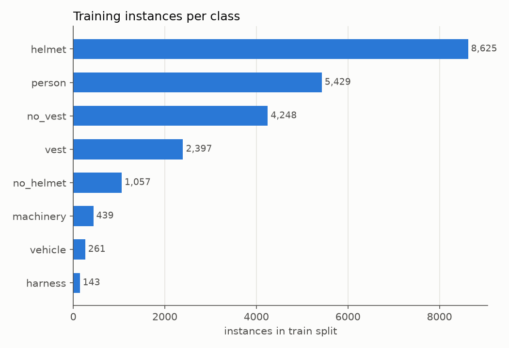
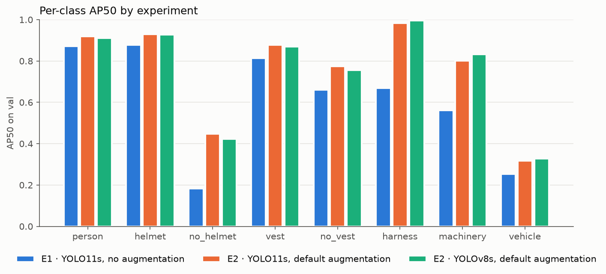

# Phase 1 Results · Baseline Demo v1

> 中文版：[README.md](README.md)

> Status (2026-09-29): the baseline model, rule judgement and Demo v1 are done; **TelecomEval is deferred** (see [progress/milestones-EN.md](../../progress/milestones-EN.md#deferred)),
> so every metric below is measured on the **validation split**. It comes from the same sources as the training data, so the numbers are optimistic and for development reference only; re-evaluate and update this page once TelecomEval is built.

## In one sentence

A YOLO11s baseline trained on 5,537 de-duplicated images from 5 public datasets reaches mAP50 = **0.756** on the validation split (E2); Ultralytics' default conventional augmentation beats no augmentation at all (E1, 0.611) by **+14.5 points**, improving all 8 classes. The weakest classes are vehicle, no_helmet and machinery; harness looks strong on the validation split but is barely detected on telecom construction images — the first target for phase 2's generative augmentation.

## Data

- Dataset sources, links, licences and actual counts: [`data/README-EN.md`](../../data/README-EN.md)
- Statistics: [`dataset_stats.csv`](dataset_stats.csv) ｜ Annotation coverage: [`coverage.csv`](coverage.csv) ｜ Licences: [`dataset_licences.csv`](dataset_licences.csv)

| Dataset | Train / val | Main contribution |
|---|---|---|
| Construction Site Safety (Roboflow v30, un-augmented) | 615 / 68 | All 7 classes; the only source of machinery and vehicles |
| APD (shared with us, internal training only) | 2,033 / 226 | No vest (real sites in China) |
| Ultralytics Construction-PPE | 1,187 / 132 | Person, helmet, vest |
| construction safety v2 | 1,010 / 112 | Person, helmet |
| body_harness | 139 / 15 | Harness (only source) |

- De-duplication (pHash) removed 898 images, mostly adjacent video frames and duplicates across splits.
- Classes a dataset did not annotate were filled in by a teacher model; pseudo-labels make up **18.0%** of all boxes (5,495 / 30,535).



## Experiments (validation split, 553 images)

| Experiment | Training data | mAP50 | mAP50-95 | Precision | Recall |
|---|---|---|---|---|---|
| E1 | Public data, all built-in augmentation off | 0.611 | 0.350 | 0.690 | 0.630 |
| E2 | Public data + Ultralytics default conventional augmentation | **0.756** | **0.499** | 0.825 | 0.711 |

Training configuration: [`configs/baseline.yaml`](../../configs/baseline.yaml) (YOLO11s, 640 px, up to 100 epochs, patience 20, seed 0). E1 stopped early at epoch 42 and E2 at epoch 90. Per-class results: [`per_class_ap.csv`](per_class_ap.csv)



Confusion matrices: [E1](e1_confusion_matrix.png) ｜ [E2](e2_confusion_matrix.png) ｜ [E2 · YOLOv8s](e2_yolov8s_confusion_matrix.png) ｜ [E2 · YOLO11m](e2_yolo11m_confusion_matrix.png)

### Model choice: YOLO11s vs YOLOv8s

Same data, configuration and random seed as E2; the only variable is the architecture (`python -m telecomsafe.train --exp e2 --model yolov8s.pt --name e2_yolov8s`).

| Model | mAP50 | mAP50-95 | Precision | Recall | Parameters | Weights | GPU inference* | CPU inference* |
|---|---|---|---|---|---|---|---|---|
| **YOLO11s (E2, adopted)** | **0.756** | **0.499** | 0.825 | 0.711 | 9.4 M | 19.2 MB | ~15 ms | **~130 ms** |
| YOLOv8s | 0.755 | 0.494 | 0.813 | 0.736 | 11.1 M | 22.5 MB | **~12 ms** | ~154 ms |

\* RTX 4070 SUPER / local CPU, PyTorch single-image inference including pre- and post-processing; GPU averaged over 200 validation images (measured twice in swapped order, with consistent results), CPU over 100. Measured in the same session as YOLO11m in the next section. YOLOv8s stopped early at epoch 78.

- **Accuracy is a tie**: mAP50 differs by 0.001 and mAP50-95 by 0.005, normal variation for a single seed. Per class it goes both ways: YOLOv8s is ~0.03 higher on machinery, YOLO11s ~0.02 higher on no_helmet and no_vest.
- **YOLO11s is smaller and faster on CPU**: 15% fewer parameters (9.43 M vs 11.14 M) and ~16% faster CPU inference, better suited to on-site deployment without a GPU. On GPU YOLOv8s is ~2 ms faster, because YOLO11's attention block costs slightly more in PyTorch; both are far below the Demo's 3-second requirement.
- **Conclusion**: keep YOLO11s as the baseline. The YOLOv8s result also shows that the phase 1 conclusions do not depend on a particular architecture.

### Model size: YOLO11s vs YOLO11m

The phase 1 plan calls for one 11s vs 11m comparison before the configuration is frozen. Same method as above: data, configuration and seed identical to E2, only the model switched to YOLO11m (`python -m telecomsafe.train --exp e2 --model yolo11m.pt --name e2_yolo11m`), trained to early stopping like the others rather than the 30 epochs in the plan — otherwise the comparison with 11s, trained to epoch 90, would be unfair.

| Model | mAP50 | mAP50-95 | Precision | Recall | Parameters | Weights | GPU inference* | CPU inference* | Training time |
|---|---|---|---|---|---|---|---|---|---|
| **YOLO11s (E2, adopted)** | 0.756 | **0.499** | 0.825 | 0.711 | **9.4 M** | **19.2 MB** | **~15 ms** | **~130 ms** | **0.9 h** (early stop at epoch 90) |
| YOLO11m | **0.773** | 0.491 | 0.826 | 0.720 | 20.1 M | 40.5 MB | ~16 ms | ~358 ms | 1.5 h (early stop at epoch 86) |

\* Measured as in the previous section, all three models in the same session.

Per-class AP50 (11m − 11s): no_helmet **+0.049**, vehicle **+0.058**, vest +0.012, harness +0.011, helmet +0.009, no_vest +0.006, person 0.000, machinery **−0.013** (mAP50-95 −0.057).

- **mAP50 is 1.6 points higher, but the gain sits in the two smallest classes**: vehicle has only 6 validation images with 17 instances, so one or two boxes move its AP by 0.05; no_helmet has 106 instances, so its gain is more credible. The other 6 classes are essentially level.
- **The stricter mAP50-95 is 0.8 points lower**: 11m does not localise better, and machinery drops clearly.
- **Twice the cost**: 2.1× the parameters and weight size, 2.8× slower on CPU, 1.7× the training time. Single-image GPU inference differs by only ~2 ms because fixed overhead dominates.
- **Conclusion**: keep YOLO11s; `configs/baseline.yaml` is unchanged. A mixed gain under a single seed is not worth 2–3× the cost, and phase 2's E3 needs several training runs, so training cost matters too.
- **Worth noting**: 11m's gain on no_helmet (a small target) suggests headroom on small objects. A cheaper route is a larger input size (e.g. 960), which can be tried separately before freezing; once TelecomEval exists, 11s and 11m will be compared on it again.

## Demo v1

```
python -m telecomsafe.demo.app --weights runs/phase1/e2/weights/best.pt
```

Screenshots: [high-risk example](demo_ui_high_risk.png) ｜ [medium-risk example](demo_ui_medium_risk.png)

Detection → rule judgement → risk level, 0.5–1.4 s per image (RTX 4070 SUPER, model warmed up at start). Example image sources and licences: [`demo_examples/ATTRIBUTION-EN.md`](demo_examples/ATTRIBUTION-EN.md); none were used in training.

| Case | Expected | Actual | Result |
|---|---|---|---|
| Compliant work (telecom construction) | Low | Low · no violations | [screenshot](demo_results/1_compliant.jpg) |
| No helmet | Medium | Medium (R1, R2) | [screenshot](demo_results/2_no_helmet.jpg) |
| Person near operating machinery | High | High (R4) | [screenshot](demo_results/3_near_machinery.jpg) |
| Pole work without a hi-vis vest | Low | Low (R2); harness missed | [screenshot](demo_results/4_no_vest_on_pole.jpg) |
| **Failure case**: pole climber without a helmet, wearing a harness | Medium | Low · no violations; both missed | [screenshot](demo_results/5_failure_pole_climber.jpg) |

## Weak classes (phase 2 generation targets)

See [`weak_classes-EN.md`](weak_classes-EN.md). Suggested generation priority: **harness ≈ vehicle > machinery (telecom-specific vehicles and equipment) > no_helmet > no_vest**.

## Problems found and fixed along the way

- **Labels that contradict the dataset name**: what harness (vgg2coco) labels as "harness" is actually hi-vis vests → dropped.
- **Augmentation baked into a dataset**: the Kaggle version of Construction Site Safety (= Roboflow v28) has a training split made entirely of mosaics, so E1 was no longer a "no augmentation" control and the rules judged people and machines in different tiles as adjacent → switched to the un-augmented v30 and retrained teacher, E1 and E2. E2 mAP50 was 0.869 before the fix and 0.756 after; the difference was inflation from the mosaics.
- **Rule false positives**: operators in the cab were judged "near machinery" → rule R4 excludes people whose box lies inside a machine's box with their feet clearly above the machine's bottom edge.

## Limitations

- **Evaluation**: not yet evaluated on TelecomEval; the validation split shares sources with training, so metrics are optimistic.
- **Harness**: only 143 training instances from a single source; the validation AP50 of 0.984 is not trustworthy, and not one harness was detected on 31 telecom construction images.
- **Pseudo-labels**: 18% of boxes; the teacher rarely fills in missing classes on images it was trained on (almost no no_vest added to Construction-PPE).
- **Rules**: person–machine distance is scaled from the person's box height, a monocular approximation that ignores depth.
- **Data sources**: APD is private data shared with us whose images come from news websites; internal training only, never redistributed.

## Next steps

1. Resume TelecomEval: search further, annotate, freeze, then re-evaluate E1 / E2 on TelecomEval and update this page.
2. TGB meeting (end of W7): present following the phase 1 plan, run the Demo live, and have a screen recording ready as backup.
3. Phase 2 (M3, W8–W10): generative augmentation targeting the weak classes; E3 keeps `configs/baseline.yaml` and changes only the training data.
